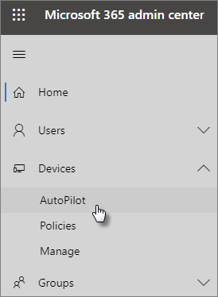

# Autopilot-laitteiden ja -profiilien lisääminen vaiheittaisen ohjeen avulla

Windows AutoPilotin avulla voit määrittää yrityksesi uudet **Windows** 10 -laitteet, jotta ne ovat valmiina käytettäväksi, kun annat ne työntekijöillesi.
  
## Laitevaatimukset

Laitteiden on täytettävä seuraavat vaatimukset:
  
- Windows 10, versio 1703 tai uudempi
    
- Uudet laitteet, jotka eivät ole käyneet läpi Windowsin käyttökokemusta
    
## Käytä laitteiden ja profiilien määritysopasta

Jos et ole vielä luonut laiteryhmiä tai -profiileja, paras tapa aloittaa on käyttää vaiheittaista opasta. Voit myös lisätä [laitteita ja](create-and-edit-autopilot-devices.md) [määrittää profiileja](create-and-edit-autopilot-profiles.md) niihin ilman opasta. 
  
1. Siirry hallintakeskukseen osoitteessa <a href="https://go.microsoft.com/fwlink/p/?linkid=837890" target="_blank">https://admin.microsoft.com</a> .

2. Valitse vasemmassa siirtymisruudussa  \> **Laitteet- autopilotti.**

    
  
2. Napsauta **tai napauta AutoPilot-sivulla** **Aloitusopas.**
    
    
  
3. Siirry **.csv-tiedoston ja** laiteluettelon lataussivulla sijaintiin, johon olet valmistautunut. CSV-tiedosto ja **sitten Avaa** \> **seuraava.** Tiedostossa on oltava kolme otsikkoa:
    
    - Sarake A: Laitteen sarjanumero
    
    - Sarake B: Windows-tuotetunnus
    
    - Sarake C: Laitteisto-hash
    
    Saat nämä tiedot laitteiston toimittajalta tai voit luoda [CSV-tiedoston Käyttämällä Get-WindowsAutoPilotInfo PowerShell-komentosarjaa.](https://www.powershellgallery.com/packages/Get-WindowsAutoPilotInfo) 
    
    Katso lisätietoja [Laiteluettelon CSV-tiedostosta](../admin/misc/device-list.md). Voit myös ladata esimerkkitiedoston **Lataa laiteluettelon sisältävä .csv-tiedosto** -sivulta. 
    
> [!NOTE]
> Tämä komentosarja noutaa WMI:n avulla ominaisuudet, joita tarvitaan, jotta asiakas voi rekisteröidä laitteen Windows Autopilotiin. Huomaa, että on normaalia, että tuloksena syntyvä CSV-tiedosto ei kerää Windows-tuotetunnusta (PKID), koska tätä ei tarvita laitteen rekisteröimiseen, ja PKID on tyhjäarvoinen csv-tulostetiedostossa. Vain sarjanumero ja laitteiston hash täytetään.
    
4. Määritä **profiili -sivulla** voit joko valita olemassa olevan profiilin tai luoda uuden. Jos sinulla ei vielä ole sitä, sinua pyydetään luomaan sellainen. 
    
    Profiili on asetuskokoelma, jota voidaan soveltaa yksittäiseen laitteeseen tai laiteryhmään.
    
    Oletusominaisuudet ovat pakollisia, ja ne määritetään automaattisesti. Oletusominaisuudet ovat:
    
    - Ohita Cortana, OneDrive ja OEM-rekisteröinti.
    
    - Luo yrityskuvan mukainen kirjautumiskokemus.
    
    - Yhdistä laitteet Azure Active Directory -tileihin ja rekisteröi ne automaattisesti Microsoft 365 Business Premiumin hallinnoitavaksi.
    
    Lisätietoja on kohdassa Tietoja [AutoPilot-profiiliasetuksista.](autopilot-profile-settings.md) 
    
5. Toiset asetukset ovat **Ohita suojausasetukset** ja **Älä salli käyttäjän ryhtyä paikalliseksi järjestelmänvalvojaksi**. Nämä molemmat ovat oletusarvoisesti **Poissa käytöstä**. 
    
    Valitse **Seuraava**.
    
6. **Kun olet valmis,** luomaasi (tai valitsemaasi) profiilia käytetään luomaasi laiteryhmään lataamalla laiteluettelo. Asetukset ovat voimassa, kun laitteen käyttäjät kirjautuvat sisään seuraavan kerran. Valitse **Sulje**.
