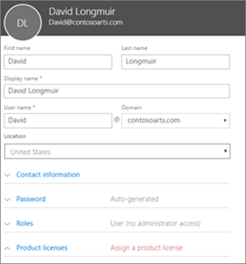
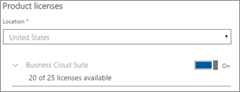

# Lisää käyttäjiä Microsoft 365 BusinessiinAdd more users to Microsoft 365 Business

## Lisää uusia käyttäjiäAdd new users

Katso lyhyt video käyttäjän lisäämisestä.Watch a short video about adding a user.   

> [!VIDEO https://www.microsoft.com/videoplayer/embed/RE1FOfN] 

Jos tämä video on mielestäsi hyödyllinen, tutustu [täydelliseen koulutussarjaan pienyrityksille ja uusille Microsoft 365 -käyttäjille](https://support.office.com/article/6ab4bbcd-79cf-4000-a0bd-d42ce4d12816).If you found this video helpful, check out the [complete training series for small businesses and those new to Microsoft 365](https://support.office.com/article/6ab4bbcd-79cf-4000-a0bd-d42ce4d12816).

Voit lisätä käyttäjän:To add a user:

1. Siirry hallintakeskukseen osoitteessa <a href="https://go.microsoft.com/fwlink/p/?linkid=837890" target="_blank">https://admin.microsoft.com</a>.Go to the admin center at <a href="https://go.microsoft.com/fwlink/p/?linkid=837890" target="_blank">https://admin.microsoft.com</a>. 
2. Valitse vasemmasta siirtymisruudusta **Käyttäjät Aktiiviset** \> **käyttäjät**.In the left navigation pane, choose **Users** \> **Active users**.
3. Valitse **Aktiiviset käyttäjät** -sivulla **Lisää käyttäjä**.On the **Active users** page, choose **Add a user**.
4. Kirjoita **tarvittavat** tiedot Uusi käyttäjä -paneeliin.In the **New user** panel, type the required information. 
  
    Voit kirjoittaa lisätietoja **Yhteystiedot**-kohtaan , valita **Salasana-asetuksen** salasanan määritystavan ja määrittää rooleja **Roolit**-kohdassa.You can enter more information under **Contact information**, choose how you set the password under **Password** setting, and assign roles under **Roles**.
      
    
      
    Määritä Tuotteen käyttöoikeudet -osassa **Microsoft 365 Business -tuotteen** käyttöoikeusasetukseksi **Käytössä**.In the Product licenses section, set the **Microsoft 365 Business** product license setting to **On**.
      
    
  
Lisätietoja käyttäjien lisäämisestä on [ohjeaiheessa Käyttäjien lisääminen yksitellen tai joukkona](https://docs.microsoft.com/office365/admin/add-users/add-users).For  more information about adding users, see [Add users individually or in bulk](https://docs.microsoft.com/office365/admin/add-users/add-users).
  
