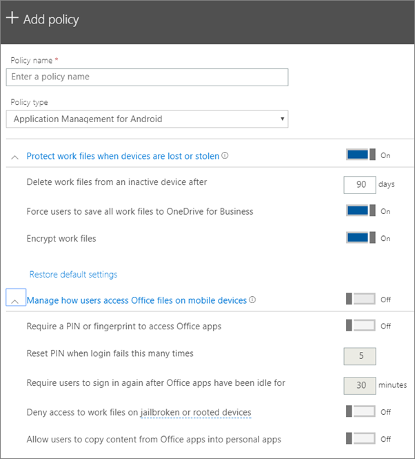

# Sovellusten suojausasetusten määrittäminen Android- tai iOS-laitteita varten

Tämä artikkeli koskee Microsoft 365 Business Premium.

## Sovellustenhallintakäytännön luominen

1. Siirry hallintakeskukseen osoitteessa <a href="https://go.microsoft.com/fwlink/p/?linkid=837890" target="_blank">https://admin.microsoft.com</a> . 
    
2. Valitse vasemmassa siirtymispalkin kohdassa  \> **Laitekäytännöt** \> **Lisää**.
  
3. Kirjoita **Lisää käytäntö** -ruutuun yksilöivä nimi tälle käytännölle. 
    
4. Valitse **Käytännön tyyppi**-kohdassa **Androidin sovellusten** hallinta tai **iOS:n** sovellusten hallinta sen mukaan, mitkä käytännöt haluat luoda. 
    
5. Laajenna **Työtiedostojen suojaaminen laitteiden katoamista tai varastamista** varten ja Käyttäjien tiedostojen Office **mobiililaitteissa.** Määritä asetukset, jotka haluat. **Hallitse sitä, miten Office tiedostojen** käyttö  mobiililaitteissa on oletusarvoisesti poissa käytöstä, mutta on suositeltavaa ottaa se **käyttöön** ja hyväksyä oletusarvot. Lisätietoja on kohdassa Käytettävissä [olevat asetukset.](#available-settings) 
    
    Voit aina palauttaa oletusasetuksen **Oletusasetusten palauttaminen** -linkin avulla. 
    
    
  
6. Päätä seuraavaksi, **ketkä saavat nämä asetukset**. Jos et halua käyttää oletusarvoista  Kaikki käyttäjät -käyttöoikeusryhmää, valitse **Muuta**, valitse käyttöoikeusryhmät, jotka saavat nämä asetukset \> **Valitse**.
    
7. Lopuksi tallenna käytäntö valitsemalla **Valmis** ja määritä se laitteisiin. 
    
## Sovellustenhallintakäytännön muokkaaminen

1. Valitse **Käytännöt-kortissa** **Muokkaa käytäntöä**.
    
2. Valitse **Muokkaa käytäntöä** -ruudussa käytäntö, jota haluat muuttaa. 
    
3. Valitse **Muokkaa** jokaisen asetuksen vieressä ja muuta käytännön arvoja. Kun muutat arvoa, se tallennetaan automaattisesti käytännön mukaisesti.
    
4. Kun olet valmis, sulje Muokkaa **käytäntöä -ruutu.** 
    
## Sovellustenhallintakäytännön poistaminen

1. Valitse **Käytännöt-sivulla** käytäntö ja valitse sitten **Poista**.
    
2. Poista **valitsemasi käytäntö** tai **käytännöt** valitsemalla Poista käytäntö -ruudussa Vahvista. 
    
## Käytettävissä olevat asetukset

Seuraavissa taulukoissa on tarkkoja tietoja käytettävissä olevista asetuksista, joilla suojataan työtiedostoja laitteissa, sekä asetuksista, joilla hallitaan sitä, Office käyttää tiedostoja mobiililaitteilla.
  
 Lisätietoja on kohdassa Miten [windows-tietokoneen suojausominaisuudet Microsoft 365 Business Premium Intune-asetuksiin.](map-protection-features-to-intune-settings.md) 
  
### Työtiedostojen suojaamisasetukset

Seuraavilla asetuksilla voidaan suojata työtiedostoja, jos käyttäjän laite katoaa tai varastetaan:

|Asetus    |Kuvaus    |
|:-----|:-----|
|Poista työtiedostot passiivisesta laitteesta näin monen päivän kuluttua    |Jos laitetta ei käytetä tässä määrittämääsi päivään, laitteeseen tallennetut työtiedostot poistetaan automaattisesti.    |
|Pakota käyttäjät tallentamaan kaikki työtiedostot OneDrive for Businessiin    |Jos tämä asetus **on Käytössä,** työtiedostojen ainoa käytettävissä oleva tallennussijainti OneDrive for Business.    |
|Salaa työtiedostot    |Pidä tämä asetus **käytössä**, jotta työtiedostot suojataan salauksella. Vaikka laite katoaa tai varastetaan, kukaan ei voi lukea yritystietojasi.    |
   
### Asetukset, joilla hallitaan käyttäjien Office-tiedostojen käyttöä mobiililaitteilla

Käyttäjien Office-työtiedostojen käyttöä voidaan hallita seuraavilla asetuksilla:

|Asetus    |Kuvaus    |
|:-----|:-----|
|Office-sovellusten käyttäminen edellyttää PIN-koodia tai sormenjälkeä    |Jos tämä asetus **on käytössä,** käyttäjien on annettava toinen todennusmuoto käyttäjänimen ja salasanan lisäksi, ennen kuin he Office mobiilisovelluksissaan.  |
|Palauta PIN-koodi, jos kirjautuminen epäonnistuu näin monta kertaa    |Jos haluat estää luvatonta käyttäjä arvaamasta PIN-koodia sattumalta, PIN-koodi palautetaan määrittämäsi virheellisten syöttökertojen määrän jälkeen.    |
|Vaadi käyttäjää kirjautumaan uudelleen, jos Office-sovellukset ovat olleet käyttämättöminä    |Tämä asetus määrittää, kuinka kauan käyttäjä voi olla käyttämättömänä, ennen kuin häntä pyydetään kirjautumaan uudelleen sisään.    |
|Estä työtiedostojen käyttö laitteissa, joiden suojaukset on murrettu    |Kekseliäällä käyttäjällä voi olla laite, jonka suojaus on murrettu. Tämä tarkoittaa, että käyttäjä voi muokata käyttöjärjestelmää, minkä vuoksi laite voi altistua helpommin haittaohjelmille. Tällaiset laitteet on estetty, kun tämä asetus on **käytössä**.    |
|Älä salli käyttäjien kopioida sisältöä Office sovelluksista henkilökohtaisiin sovelluksiin    |Oletuksena tätä ei sallita, mutta jos asetus on **käytössä**, käyttäjä voi kopioida työtiedoston tietoja henkilökohtaiseen tiedostoon. Jos asetuksena on **Ei käytössä**, käyttäjä ei voi kopioida tietoja työtilistä henkilökohtaiseen sovellukseen tai henkilökohtaisen tiliin.    |
