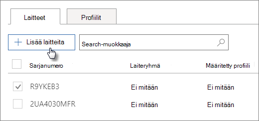

# Autopilot-laitteiden luominen ja muokkaaminenCreate and edit AutoPilot devices

## Laiteluettelon lataaminenUpload a list of devices

Voit ladata laitteita [vaiheittaiset](add-autopilot-devices-and-profile.md) ohjeet avulla, mutta voit myös ladata laitteita **Laitteet-välilehdessä.**You can use the [Step-by-step guide](add-autopilot-devices-and-profile.md) to upload devices, but you can also upload devices in the **Devices** tab. 
  
Laitteiden on täytettävä seuraavat vaatimukset:Devices must meet these requirements:
  
- Windows 10, versio 1703 tai uudempiWindows 10, version 1703 or later
    
- Uudet laitteet, jotka eivät ole käyneet läpi Windowsin käyttökokemustaNew devices that haven't been through Windows out-of-box experience

1. Valitse Microsoft 365 -hallintakeskuksessa **Laitteet** \> **AutoPilot.**In the Microsoft 365 admin center, choose **Devices** \> **AutoPilot**.
  
2. Valitse **AutoPilot-sivulla** **Laitteet-välilehti** \> **Lisää laitteita.**On the **AutoPilot** page, choose the **Devices** tab \> **Add devices**.
    
    
  
3. Siirry Lisää **laitteita -paneelissa** laiteluettelon CSV-tiedostoon, jonka valmistit  \> **Tallenna** sulje \> **- valmis.**On the **Add devices** panel, browse to a [Device list CSV file](../admin/misc/device-list.md) that you prepared \> **Save** \> **Close**.
    
    Saat nämä tiedot laitteiston toimittajalta tai voit luoda [CSV-tiedoston Käyttämällä Get-WindowsAutoPilotInfo PowerShell-komentosarjaa.](https://www.powershellgallery.com/packages/Get-WindowsAutoPilotInfo)You can get this information from your hardware vendor, or you can use the [Get-WindowsAutoPilotInfo PowerShell script](https://www.powershellgallery.com/packages/Get-WindowsAutoPilotInfo) to generate a CSV file. 
    
## Profiilin määrittäminen laitteelle tai laiteryhmälleAssign a profile to a device or a group of devices

1. Valitse **Valmistele Windows** -sivulla **Laitteet-välilehti** ja valitse yhden tai useamman laitteen vieressä olevaa valintaruutua.On the **Prepare Windows** page, choose the **Devices** tab, and select the check box next to one or more devices. 
    
2. Valitse **Laitteet**-paneelista profiili avattavasta **Määritetty profiili** -luettelosta.On the **Device** panel, select a profile from the **Assigned profile** drop-down. 
    
    Jos sinulla ei ole vielä profiileja, katso ohjeita artikkelista [AutoPilot-profiilien luominen ja muokkaaminen](create-and-edit-autopilot-profiles.md).If you don't have any profiles yet, see [Create and edit AutoPilot profiles](create-and-edit-autopilot-profiles.md) for instructions. 
