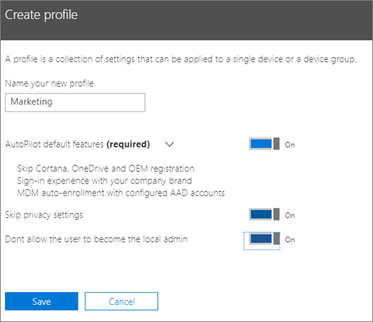
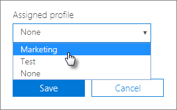

# Autopilot-profiilien luominen ja muokkaaminen

## Uuden sähköpostiprofiilin luominen

Profiilia käytetään laitteeseen tai laiteryhmään
  
1. Valitse Microsoft 365 Business -hallintakeskuksessa **Laitteiden** \> **automaattiohjaus**.
  
2. Valitse **AutoPilot-sivulla** **Profiilit-välilehden** \> **Luo profiili**.
    
3. Kirjoita **Luo profiili** -sivulle profiilin nimi, jonka avulla voit tunnistaa sen, esimerkiksi Markkinointi. Ota haluamasi asetus käyttöön ja valitse sitten **Tallenna**. Lisätietoja AutoPilot-profiiliasetuksista on kohdassa [Tietoja autopilotin profiiliasetuksista](autopilot-profile-settings.md).
    
    
  
### Profiilin käyttäminen laitteeseen

Kun olet luonut profiilin, voit käyttää sitä laitteessa tai laiteryhmässä. Voit valita aiemmin luodun profiilin [vaiheittaisesta oppaasta](add-autopilot-devices-and-profile.md) ja ottaa sen käyttöön uusissa laitteissa tai korvata olemassa olevan profiilin laitteelle tai laiteryhmälle. 
  
1. Valitse **Valmistele Windows** -sivulla **Laitteet**-välilehti. 
    
2. Valitse laitteen nimen vieressä oleva valintaruutu ja valitse Laite-paneelista profiili avattavasta Määritetty \> **profiili** -luettelosta **Tallenna**. ****
    
    
  
## Profiilin muokkaaminen tai poistaminen

Kun olet määrittänyt profiilin laitteeseen, voit päivittää sen, vaikka olet jo antanut laitteen käyttäjälle. Kun laite muodostaa internet-yhteyden, se lataa profiilisi uusimman version asennuksen aikana. Jos käyttäjä palauttaa laitteen tehdasasetukset, laite lataa uudelleen profiilin uusimmat päivitykset. 
  
### Profiilin muokkaaminen

1. Valitse **Valmistele Windows** -sivulla **Profiilit**-välilehti. 
    
2. Valitse laitteen nimen vieressä oleva valintaruutu ja päivitä **Profiili-paneelissa** kaikki \> käytettävissä olevat asetukset **Tallenna**.
    
    Jos teet näin, ennen kuin käyttäjä yhdistää laitteen internetiin, profiilia käytetään asennuksessa.
    
### Profiilin poistaminen

1. Valitse **Valmistele Windows** -sivulla **Profiilit**-välilehti. 
    
2. Valitse laitteen nimen vieressä oleva valintaruutu ja valitse **Profiili-paneelista** Poista **profiilin** \> **tallennus**.
    
    Kun poistat profiilin, se poistetaan siitä laitteesta tai laiteryhmästä, johon se määritettiin.
    
### Profiilin poistaminen

1. Valitse **Valmistele Windows** -sivulla **Laitteet**-välilehti. 
    
2. Valitse laitteen nimen vieressä oleva valintaruutu ja valitse Laite-paneelista Avattavasta **Määritetty profiili** \> **-luettelosta** **Ei mitään.** ****
    
