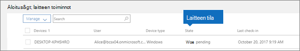

# Laitteen tilatDevice states

**Laitetoiminnot**-luettelon (hallintakeskuksen aloitussivu \> **Laitetoiminnot**) laitteilla voi olla seuraavat tilat.Devices in the **Device actions** list (Admin home \> **Device actions**) can have the following states.
  

  
|**Tila****Status**|**Kuvaus****Description**|
|:-----|:-----|
|Intunen hallitsemaManaged by Intune    |Microsoft 365 Businessn hallitsemaManaged by Microsoft 365 Business.    |
|Käytöstä poistaminen odottaaRetire pending    |Microsoft 365 Business on valmiina poistamaan yritystiedot laitteesta.Microsoft 365 Business is getting ready to remove company data from the device.    |
|Käytöstä poistaminen on käynnissäRetire in progress    |Microsoft 365 Business poistaa parhaillaan yritystietoja laitteesta.Microsoft 365 Business is currently removing company data from the device.    |
|Käytöstä poistaminen epäonnistuiRetire failed    | Yritystietojen poisto epäonnistui.Remove company data action failed.    |
|Eläkkeelle peruuttaminen peruutettuRetire canceled    |Eläkkeelle siirtyminen toiminto peruutettiin.Retire action was canceled.    |
|Tyhjennys odottaaWipe pending    |Tehdasasetusten palauttamista odotetaan.Waiting for factory reset to start.    |
|Tyhjennys käynnissäWipe in progress    |Tehdasasetusten palautus on määritetty.Factory reset has been issued.    |
|Tyhjennys epäonnistuiWipe failed    |Tehdasasetusten palautusta ei voitu tehdä.Couldn't do factory reset.    |
|Pyyhi peruutettuWipe canceled    |Tehdaspyyhintä peruttiin.Factory wipe was canceled.    |
|ViallinenUnhealthy    |Toiminto odottaa (tai on käynnissä), mutta laite ei ole kirjautunut sisään yli 30 päivään.An action is pending (or in progress), but the device hasn't checked in for 30+ days.    |
|Poisto odottaaDelete pending    |Poistotoimintoa odotetaan.Delete action is pending.    |
|TunnistettuDiscovered    |Microsoft 365 Business on tunnistanut laitteen.Microsoft 365 Business has detected the device.    |
   
