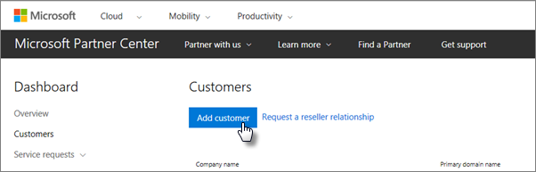
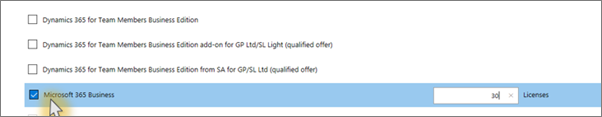

# Hanki Microsoft 365 Business PremiumGet Microsoft 365 Business Premium

## Hanki Microsoft 365 Business PremiumGet Microsoft 365 Business Premium from Microsoft

Jos sinulla ei ole kumppania ja haluat hankkia Microsoft 365 Business Premiumin, voit [ostaa sen täältä.](https://www.microsoft.com/en-US/microsoft-365/business)If you don't have a partner and want to get Microsoft 365 Business Premium, you can [buy it here](https://www.microsoft.com/en-US/microsoft-365/business).

Katso [tarkat ohjeet Microsoft 365 Business Premium -rekisteröityminen.](sign-up.md)See [sign up for Microsoft 365 Business Premium](sign-up.md) for detailed instructions.

Voit myös ostaa Microsoft 365 Business Premiumin Microsoft [Storesta](https://www.microsoft.com/en-us/store/locations/find-a-store?icid=en_US_Store_UH_FAS) ja saada asennus ohjeita.You can also head over to a [Microsoft Store](https://www.microsoft.com/en-us/store/locations/find-a-store?icid=en_US_Store_UH_FAS) to buy Microsoft 365 Business Premium and get setup help.
  
## Hanki Microsoft 365 Business Premium Microsoft-kumppanikeskuksestaGet Microsoft 365 Business Premium from Microsoft Partner Center

1. Kirjaudu [Microsoft-kumppanikeskukseen](https://go.microsoft.com/fwlink/p/?linkid=849910) tunnistetiedoilla, jotka loit rekisteröityessäsi pilvipalveluntarjoajaohjelmaan (CSP).Sign in at [Microsoft Partner Center](https://go.microsoft.com/fwlink/p/?linkid=849910) by using the credentials you created when you enrolled to the Cloud Service Provider (CSP) program. 
    
2. Valitse Kumppanin koontinäytössä **Asiakkaat** ja valitse sitten asiakas tai lisää uusi asiakas, ennen kuin hankit Microsoft 365 Business Premiumin.On the Partner Dashboard, choose **Customers**, then select your customer or add a new customer before you get Microsoft 365 Business Premium.
    
    
  
3. Valitse asiakkaan Tilaus-sivulla Lisää tilaus, valitse Pienyritys-vaihtoehto Luettelo-kohdassa ja valitse sitten **Microsoft 365 Business Premium.** On the customer's **Subscription** page, select **Add subscription**, choose the Small business option under Catalog, and then choose **Microsoft 365 Business Premium**.
    
    Valitse tarvitsemasi määrä käyttöoikeuksia (enintään 300).Select the number of licenses you need (up to 300). Jos käyttäjiä on yli 300, tutustu sen sijaan [Microsoft 365 Enterpriseen](../enterprise/index.yml).If you have more than 300 users, see [Microsoft 365 Enterprise](../enterprise/index.yml) instead. 
    
    
  
    Täytä loput uuden asiakkaan, mukaan lukien yrityksen nimen, lisäämisen vaiheet.Complete the rest of the steps for adding a new customer, including the business name.
