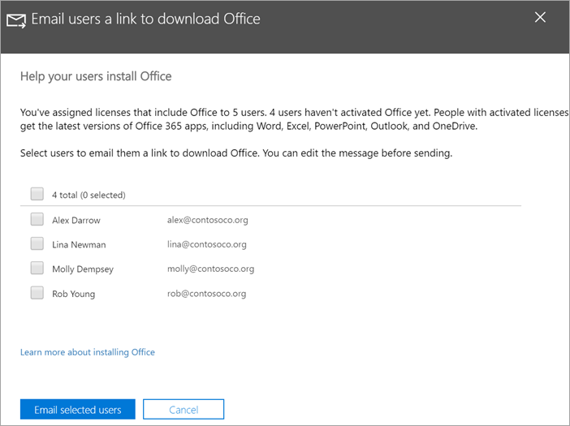

# Auta käyttäjiä asentamaan Office Windows 10 -laitteisiin

Voit asentaa Officen nopeasti ja helposti Windows 10 -tietokoneisiin Microsoft 365 -hallintakeskuksesta.
  
Jotta ymmärrät, miten se toimii aiemmin asennettujen Office-sovellusten kanssa, lue [Office-asiakasohjelman asennuksen valmisteleminen](prepare-for-office-client-deployment.md) ennen aloittamista.

Katso lyhyt video Office-sovellusten asentamisesta.  

> [!VIDEO https://www.microsoft.com/videoplayer/embed/acce002c-0756-4b64-ac5d-2198ee96a9b1] 

Jos tämä video on mielestäsi hyödyllinen, tutustu [täydelliseen koulutussarjaan pienyrityksille ja uusille Microsoft 365 -käyttäjille](https://support.microsoft.com/office/6ab4bbcd-79cf-4000-a0bd-d42ce4d12816).

## Officen käyttöönoton hallinta

1. Siirry hallintakeskukseen osoitteessa ja <a href="https://go.microsoft.com/fwlink/p/?linkid=2024339" target="_blank">https://admin.microsoft.com</a> kirjaudu sisään yleisen järjestelmänvalvojan tunnistetiedoilla. 

2. Siirry  vasemmassa siirtymisruudussa Kohtaan Asetukset ja **vieritä** Asetukset-sivulla Sovellukset ja **päivitykset -kohtaan.**
    > [!NOTE]
    > Et ehkä näe tätä korttia, jos kaikki käyttäjät ovat asentaneet Office-sovelluksia.
  
3. Valitse **Ohjekäyttäjät asentavat** Office-sovelluskorttinsa, **valitse Näytä** ja sitten **Aloita.**
    
4. Valitse Sähköpostin **käyttäjät -kohdassa linkki Office-paneelin** lataamista varten, valitse käyttäjät, jotka haluat lähettää sähköpostitse, ja valitse sitten Lähetä valitut **käyttäjät sähköpostitse.**

   

## Lisätietoja Microsoft 365 Business Premiumin määrittämisestä ja käyttämisestä

[Microsoft 365 for Business -koulutusvideot](https://support.microsoft.com/office/6ab4bbcd-79cf-4000-a0bd-d42ce4d12816)