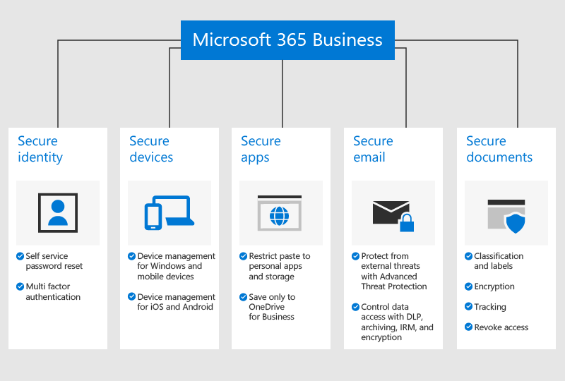

# Microsoft 365 Business Premiumin yleiskatsaus

## Mikä on Microsoft 365 Business Premium

Microsoft 365 Business Premium (aiemmin Microsoft 365 Business) on kattava tilauspalvelu yrityksille, joissa on alle 300 työntekijää. Se yhdistää Officen tutut tuottavuussovellukset ja -palvelut Microsoft Teamsin kaltaisiin yhteiskäyttötyökaluihin ja sisältää kehittyneen suojauksen sekä laitteiden hallintaan liittyviä ominaisuuksia.

Katsomalla tämän lyhyen videon saat yleiskatsauksen Microsoft 365 Business Premiumista.  

> [!VIDEO https://www.microsoft.com/videoplayer/embed/RE2mhaA] 
  
Jos tämä video on mielestäsi hyödyllinen, tutustu [täydelliseen koulutussarjaan pienyrityksille ja uusille Microsoft 365 -käyttäjille](https://support.microsoft.com/office/6ab4bbcd-79cf-4000-a0bd-d42ce4d12816). 

Microsoft 365 Business Premium on tarkoitettu enintään 300 käyttöoikeudelle. Jos tarvitset enemmän käyttöoikeuksia, saat lisätietoja [Microsoft 365 Enterprise](https://go.microsoft.com/fwlink/p/?linkid=860986) -ohjeista.

Näet ominaisuuksien täyden luettelon artikkelissa [Microsoft 365 Business Premium -palvelukuvaus](https://docs.microsoft.com/office365/servicedescriptions/microsoft-365-service-descriptions/microsoft-365-business-service-description).
  
## Pienyrityksen tietoturvatarpeet

Yrityksesi tiedot voivat vaarantua monella eri tapaa. Sinä ja käyttäjäsi saatatte vaarantaa organisaation turvallisuuden, kun kirjaudutte sisään vaarantuneilla käyttäjätiedoilla tai tarkastelette organisaation tietoja eri laitteissa ja sovelluksissa. Tarkemmin sanottuna organisaatiollesi aiheuttavat vaaraa seuraavat asiat:

- vaarantuneet tai heikot kirjautumistiedot
- vaarantunut laite, jossa on heikko PIN-koodi, tai käyttäjän omistama laite
- käyttäjät, jotka kopioivat, liittävät tai tallentavat organisaation tietoja henkilökohtaisiin sovelluksiin
- käyttäjät, jotka asentavat ja käyttävät kolmannen osapuolen sovelluksia, joissa on heikko suojaus
- sähköpostihaavoittuvuudet, kuten luottamuksellisten tietojen jakaminen, tietojenkalasteluyritykset ja haittaohjelmat
- tilanteet, joissa henkilöt pääsevät käsiksi luottamuksellisiin tietoihin, joita heidän ei pitäisi voida käyttää.

Microsoft 365 Business Premium auttaa suojaamaan tietojasi kaikissa näissä tilanteissa. Yritystietojasi suojaavat ominaisuudet esitetään yksityiskohtaisesti seuraavassa kuvassa.

## Miten tietosi ja laitteesi suojataan

Microsoft 365 Business Premium auttaa **suojautumaan uhkia vastaan** seuraavilla tavoilla:

- tarkistamalla sähköpostiviestien ja asiakirjojen sisältämät linkit reaaliajassa, jotta vaaralliset verkkosivustot voidaan estää (ATP:n Turvalliset linkit)

- suorittamalla sähköpostin liitteiden kehittyneen analyysin eristetyssä ympäristössä, jotta hiljattain kehitetyt haittaohjelmat voidaan havaita (ATP:n Turvalliset liitteet) 

- ottamalla käyttöön tietojenkalastelun torjuntakäytäntöjä, jotka hyödyntävät koneoppimismalleja ja tekeytymistunnistusta tarjotakseen suojaa edistyneitä hyökkäyksiä vastaan (ATP:n tietojenkalastelun torjunta) 

- määrittämällä edistyneitä käytäntöjä, jotka estävät käytön epäluotettavista sijainneista tai ohittavat monimenetelmäisen todentamisen luotetuissa sijainneissa, kuten yrityksen verkossa (Azure MFA, mukaan lukien luotetut IP-osoitteet ja ehdollinen käyttö) 

- ottamalla käyttöön haittaohjelmilta suojautumisen kaikissa organisaation Windows 10 -laitteissa ja suojaamalla tärkeimpien järjestelmäkansioiden tiedostoja haittaohjelmien tekemiltä muutoksilta (Windows Defender).

**Yrityksesi tietoja suojataan** seuraavilla tavoilla:

- käyttämällä automaattista tunnistusta, jonka avulla estetään luottamuksellisten tietojen, kuten sosiaaliturvatunnusten tai luottokorttinumeroiden, vuotaminen yrityksen ulkopuolelle (tietojen menetyksen estäminen) 

- Salaamalla luottamukselliset sähköpostiviestit, jotta voit viestiä turvallisesti asiakkaiden tai muiden organisaation ulkopuolisten henkilöiden kanssa. Tämän avulla varmistetaan, että vain tarkoitettu vastaanottaja voi lukea viestin (Office 365 -viestin salaus).

- hallitsemalla sitä, kenellä on yrityksen tietojen käyttöoikeudet, lisäämällä sähköpostiviesteihin ja asiakirjoihin rajoituksia, kuten **Älä kopioi** ja **Älä lähetä edelleen** (Azure Information Protection, palvelupaketti 1)

- ottamalla käyttöön rajoittamattoman pilvipalveluun arkistoinnin, jotta voit säilyttää kaikki organisaation sähköpostit, myös entisten työntekijöiden postilaatikot (Exchange Online Archiving).

**Laitteitasi suojataan** seuraavilla tavoilla:

- Hallitsemalla sitä, mitkä laitteet ja ketkä käyttäjät voivat käyttää yrityksen Microsoft-tietoja. Voit estää käyttäjiä kirjautumasta sisään kotitietokoneista, hyväksymättömistä sovelluksista tai työajan ulkopuolella (ehdollinen käyttöoikeus).

- Lisäämällä suojauskäytäntöjä, joiden avulla suojataan yrityksen tietoja iOS- ja Android-laitteissa. Voit esimerkiksi vaatia käyttäjiä tunnistautumaan PIN-koodilla tai sormenjäljellä, jotta organisaation tietoja voi käyttää, ja salata tiedot mobiililaitteissa (Office-mobiilisovellusten suojaus)

- pitämällä yrityksen asiakirjat, sähköpostit ja muut tiedot hyväksytyissä Office-sovelluksissa ja estämällä työntekijöitä tallentamasta tietoja hyväksymättömiin sovelluksiin ja sijainteihin (Office-mobiilisovellusten suojaus)

- pyyhkimällä yrityksen tiedot kadonneista tai varastetuista laitteista etäyhteyden välityksellä vaikuttamatta henkilökohtaisiin tietoihin (Intunen valikoiva tietojen poisto)

- käyttämällä yksinkertaisia hallintatoimintoja kaikkien yrityksen Windows 10 -tietokoneiden käytäntöjen hallintaan, pakottamalla BitLocker-salauksen ja asentamalla tärkeät Windows-päivitykset välittömästi (Windowsin päivityskäytäntöjen pakottaminen).

Näet suojausominaisuuksien täyden luettelon artikkelissa [Microsoft 365 Business Premiumin suojausominaisuudet](security-features.md). Kun olet [määrittänyt Microsoft 365 Business Premiumin](set-up.md), tutustu artikkeleihin [Uhilta suojautumisen parantaminen](increase-threat-protection.md) ja [Yhteensopivuusominaisuuksien määrittäminen](set-up-compliance.md), jotta voit alkaa käyttää suojausominaisuuksia, jotka eivät sisälly ohjattuun asennukseen. Tutustu myös artikkeliin [10 parasta tapaa suojata Office 365- ja Microsoft 365 Business Premium -palvelupaketit](https://docs.microsoft.com/office365/admin/security-and-compliance/secure-your-business-data) saadaksesi yleiskatsauksen siitä, miten voit määrittää suojauksen kyberrikollisia ja hakkereita vastaan.

## Hanki Microsoft 365 Business Premium

- Jos sinulla on kumppani, hän saa Microsoft 365 Business Premiumin seuraavasti: [Hanki Microsoft 365 Business Premium Microsoft-kumppanikeskuksesta](get-microsoft-365-business.md).

- Jos sinulla ei ole kumppania ja haluat hankkia Microsoft 365 Business Premiumin, voit [ostaa sen täältä](https://www.microsoft.com/microsoft-365/business) ja seurata [rekisteröitymisohjeita](sign-up.md).

## Tutustu myös seuraaviin ohjeartikkeleihin:

[Microsoft 365 Business Premium -koulutusvideot](https://support.microsoft.com/office/6ab4bbcd-79cf-4000-a0bd-d42ce4d12816)
