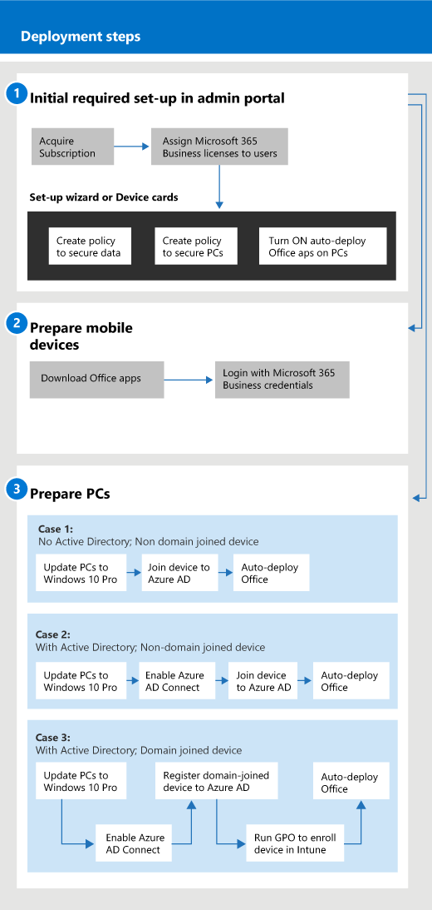

# Microsoft 365 for Businessin käytön aloittaminen

## Mikä on Microsoft 365 for Business

Microsoft 365 for Business on kattava joukko liiketoiminnan tuottavuus- ja yhteistyötyökaluja, kuten Outlook, Word, Excel ja muut Office-tuotteet, jotka ovat aina ajan tasalla. Voit suojata työtiedostosi kaikissa iOS-, Android- ja Windows 10 -laitteissa sijaistason suojauksella, jota on helppo hallita.

Tämä video opastaa microsoft 365 for Businessin pikaesittelyssä.  

> [!VIDEO https://www.microsoft.com/videoplayer/embed/RE2mhaA] 
  
Microsoft 365 for Business on tarkoitettu enintään 300 käyttöoikeuteen. Jos tarvitset enemmän käyttöoikeuksia, saat lisätietoja [Microsoft 365 Enterprise](https://go.microsoft.com/fwlink/p/?linkid=860986) -ohjeista. 
  
## Hanki Microsoft 365 for Business

- Jos sinulla on kumppani, saat Microsoft 365 for Businessin: [Hanki Microsoft 365 for Business Microsoft Partner Centeristä](get-microsoft-365-business.md).
    
- Jos sinulla ei ole kumppania ja haluat hankkia Microsoft 365 for Businessin, voit [ostaa sen täältä](https://www.microsoft.com/microsoft-365/business).
    
## Microsoft 365 for Businessin määrittäminen

 **Microsoft 365 for Business Suiten yleiskatsaus**
  
Seuraavassa kaaviossa kuvataan, miten järjestelmänvalvojat muodostavat Microsoft 365 for Businessin. Artikkelissa kuvataan myös vaiheet Windows-tietokoneiden valmistelemiseksi Microsoft 365 for Businessia varten. Voit myös lisätä uusia laitteita Microsoft 365 -hallintakeskukseen [Windows Inn -ohjauksen](add-autopilot-devices-and-profile.md)avulla. AutoPilotin avulla voit määrittää ja esimäärittää uusia laitteita niin, että ne ovat valmiita tuottavaan käyttöön heti, kun käyttäjä kirjautuu sisään Microsoft 365 for Business -tunnistetiedoillaan.
  

Tämä video on microsoft 365 for Businessin asennuksen yleiskuvaus.  

> [!VIDEO https://www.microsoft.com/videoplayer/embed/RE1FYSM] 

Jos tämä video on mielestäsi hyödyllinen, tutustu [täydelliseen koulutussarjaan pienyrityksille ja uusille Microsoft 365 -käyttäjille](https://support.office.com/article/6ab4bbcd-79cf-4000-a0bd-d42ce4d12816).

  
### 1: Microsoft 365 for Businessin määrittäminen (järjestelmänvalvoja)

Kirjaudu [Microsoft 365 -hallintakeskukseen](https://portal.office.com/adminportal/home) yleisillä järjestelmänvalvojan tunnistetiedoillasi ja määritä Microsoft 365 for Business noudattamalla seuraavia ohjeita. 
  
1. [Laitteiden tietojen suojaamisen edellytykset Microsoft 365 for Business -ohjelman avulla](pre-requisites-for-data-protection.md)
    
    Tarkista ensin edellytykset, että laitteesi ovat valmiita Microsoft 365 for Businessiin.
    
2. [Microsoft 365 for Businessin määrittäminen ohjatun asennustoiminnon avulla](set-up.md)
    
    Jos **siirryt pysyvästi paikallisesta Active Directorysta pilveen**, voit siirtyä Microsoft 365 -hallintakeskukseen ja lisätä käyttäjät manuaalisesti ohjatun asennustoiminnon avulla tai voit synkronoida käyttäjät kerran Azure AD Connectin kanssa. Tämän voi tehdä kahdella eri tavalla: 
    
    - Jos käytössäsi on myös Exchange 2010-, Exchange 2013- tai Exchange 2016 -palvelin, voit [siirtää Exchange-postilaatikot nopeasti Office 365:een käyttämällä Minimal Hybridia.](https://support.office.com/article/fdecceed-0702-4af3-85be-f2a0013937ef) Minimaalisia hybridivaiheita ovat käyttäjien kertasynkronointi Azure AD:hen ja sähköpostin siirtäminen paikallisesta pilveen. Kun sähköpostin siirto on valmis, hakemistosynkronointi poistetaan automaattisesti käytöstä, kun käytät tätä menetelmää.
    
    - Synkronoi käyttäjät pilveen ohjatun hakemistosynkronoinnin avulla. Suorita tämä prosessi noudattamalla kohdan [Microsoft 365:n hakemistosynkronoinnin määrittäminen](https://support.office.com/article/1b3b5318-6977-42ed-b5c7-96fa74b08846) ohjeita. Kun olet synkronoinut käyttäjät pilveen, sinun on [poistatava Office 365:n hakemistosynkronointi käytöstä](https://support.office.com/article/ee5f861e-bd48-4267-83d1-a4ead4b4a00d).
    
    Sinun on myös annettava jokaiselle käyttäjälle, joka on lisätty tällä tavalla, microsoft 365 for Business -käyttöoikeuden. Voit tehdä tämän [ohjatussa asennustoiminnossa](set-up.md) tai [määrittää käyttöoikeuksia Microsoft 365 for Business -järjestelmän käyttäjille.](https://docs.microsoft.com/microsoft-365/admin/add-users/add-users)
    
### 2: Mobiililaitteiden valmisteleminen

Asenna Office-sovellukset laitteisiin ja varmista, että Microsoft 365 for Business suojaa ne noudattamalla ohjeita kohdassa [Mobiililaitteiden määrittäminen Microsoft 365 for Businessille.](set-up-mobile-devices.md) 
  
### 3: Valmistele tietokoneet

Järjestelmänvalvojat voivat esivalita uusien Windows 10 -tietokoneiden asetukset [Windowsin automaattiohjauksen](add-autopilot-devices-and-profile.md)avulla. Käyttäjät voivat määrittää olemassa olevat tai uudet Windows 10 -laitteensa noudattamalla tämän ohjeaiheen ohjeita: [Windows-tietokoneiden määrittäminen Microsoft 365 :tä yrityskäyttäjille](set-up-windows-devices.md). Käyttäjät voivat **halutessaan** [siirtää tiedostoja OneDrive for Businessiin](move-files-to-onedrive.md)aiemmin luoduissa laitteissa. He voivat myös siirtää Windows-profiiliin liittyviä tiedostoja OneDriveen kolmannen osapuolen työkalujen avulla.
  
Jos organisaatiosi käyttää paikallista Windows Server Active Directorya, voit määrittää Microsoft 365 for Businessin suojaamaan Windows 10 -laitteita ja säilyttämään silti paikallisen todennuksen edellyttävien paikallisten resurssien käytön. Määritä tämä noudattamalla kohdan [Salli toimialueeseen liitetyt Windows 10 -laitteet Microsoft 365 for Businessin hallitsemia laitteita](manage-windows-devices.md) noudattamalla ohjeita. Tämä menetelmä on ensisijainen, ja tässä tilassa laitteita kutsutaan **Hybrid Azure AD -liitetyiksi laiteiksi**. 
  
Jos säilytät paikallisen Active Directoryn, joka sisältää joitakin paikallisia resursseja (kuten jaettuja tiedostoja ja tulostimia), voit antaa **Azure AD:lle liitetyille laitteille** näiden resurssien käyttöoikeuden noudattamalla seuraavia ohjeita: [Paikallisten resurssien käyttäminen Microsoft 365 for Businessin Azure AD:n yhdistetystä laitteesta.](access-resources.md)
  
  
## Ota yhteyttä tukeen

 **Jos sinun täytyy ottaa yhteyttä tukeen:**
  
- Ota yhteyttä kumppaniin.
    
- Microsoft 365 for Business -järjestelmänvalvojana voit käyttää asiakastukitiimiämme: ** [Ota yhteyttä yritystuotteiden tukeen - Järjestelmänvalvoja Ohjeet](https://support.office.com/article/32a17ca7-6fa0-4870-8a8d-e25ba4ccfd4b)**
    
## Tutustu myös seuraaviin ohjeartikkeleihin:

[Microsoft 365 for Businessin dokumentaatio ja resurssit](https://go.microsoft.com/fwlink/p/?linkid=853701)
  
[Microsoft 365 for Businessin hallinta](manage.md)[Siirtyminen Microsoft 365 for Businessiin](migrate-to-microsoft-365-business.md)

[Microsoft 365 yrityksille koulutus videoita](https://support.office.com/article/6ab4bbcd-79cf-4000-a0bd-d42ce4d12816) 
