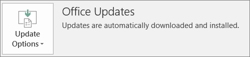

# Microsoft 365 for Businessin Office-asiakasohjelman käyttöönoton valmisteleminen

Tämä artikkeli koskee Microsoft 365 Business Premiumia.

## Valmistaudu Office-sovellusten automaattiseen asentamiseen asiakastietokoneisiin.

Microsoft 365 Business Premiumin avulla voit asentaa 32-bittiset Office-sovellukset automaattisesti Windows 10 -tietokoneisiin ja pitää ne ajan tasalla päivityksistä.
  
Automaattinen asennus toimii parhaiten, jos loppukäyttäjän tietokone on Windows 10 Businessissa ja:
  
- Ei ole olemassa olevia Office-työpöytäsovelluksia (Word, Excel, PowerPoint, Outlook, OneNote, Publisher, Access ja OneDrive).
    
    tai
    
- Tietokoneeseen on asennettu Officen pika-asennusversio.
    
Voit selvittää, onko käytössäsi Officen pika-asennusversio, valitsemalla missä tahansa Office-sovelluksessa **Tiedosto** \> **Tili** (Outlookissa **Office-tili**). Jos **näet Office-päivitykset** seuraavassa kuvassa esitetyllä tavalla, asennus tehtiin pika-asennuksen avulla. 
  

  
 **Kuka hyötyy tämän ominaisuuden saaminen**
  
Käyttäjä, jonka PC-tietokoneessa on seuraavat ominaisuudet:
  
- **On** Windows 10 Business -käyttöoikeus, aktiivinen Microsoft 365 for Business -käyttöoikeus, Windows 10 Creators Update ja se on liitetty Azure Active Directoryyn. 
    
- **Ei ole** 64-bittisiä Office-sovelluksia (esimerkiksi Word, Excel, PowerPoint). Jos tarvitaan 64-bittisiä Office-sovelluksia, tämä ominaisuus ei sovi hyvin, koska 64-bittisen 2016-2016-pika-asennusversion käynnistäminen Microsoft 365 for Business -hallintakonsolista ei tueta. 
    
- **Tietokoneessa ei ole** mitään 2016 Windows Installer (MSI) -erillissovelluksia (esimerkiksi Visiota tai Projectia). Microsoft 365 for Business päivittää Officen Office 2016:n pika-suoritusversioksi, joka ei toimi Office 2016 MSI :n erillinenjen sovellusten kanssa. 
    
Seuraavassa taulukossa on esitetty, mitä toimia käyttäjien/järjestelmänvalvojien on ehkä tehtävä niiden alkutilan mukaan, jotta Officen käyttöönoton 32-bittinen click-to-run-versio olisi onnistunut Microsoft 365 for Business -hallintakonsolista.
  
|**Office-asennuksen aloittamistila**|**Toimet ennen Microsoft 365 for Business Officen asentamista**|**Lopputila**|
|:-----|:-----|:-----|
|Ei asennettua Office-ohjelmistopakettia    |Ei mitään    |Office 2016:n 32-bittinen versio asennetaan pika-asennuksen avulla    |
|Olemassa oleva 32-bittisen Officen (2016 tai aiempi versio) pika-asennusversio, mutta ei erillissovelluksia    |Ei mitään    |Päivitetty uusimpaan 32-bittiseen Office 2016 -pika-asennusversioon tarpeen mukaisesti **\***   |
|Aiemmin luodut Officen pika-asennusversio ja 32- tai 64-bittinen erillinen Office-sovellus (esimerkiksi Visio, Project)    |Ei mitään    |Tämä ei vaikuta erillisiin sovelluksiin. Ohjelmistopaketti on päivitetty 32-bittiseen Office 2016 -pika-asennusversioon    |
|Olemassa oleva 32-bittisen Officen pika-asennusversio ja mitkä tahansa 32- tai 64-bittiset (paitsi 2016) Office MSI -erillissovellukset    |Ei mitään    |Tämä ei vaikuta erillisiin sovelluksiin. Ohjelmistopaketti on päivitetty 32-bittiseen Office 2016 -pika-asennusversioon    ||||
|Mikä tahansa 64-bittisen Officen pika-asennusversio    |Poista 64-bittisten Office-sovellusten asennus, jos niiden korvaaminen 32-bittisillä Office-sovelluksilla on OK    |Jos 64-bittiset Office-sovellukset poistetaan, 32-bittinen Office 2016 -pika-asennusversio asennetaan    |
|Olemassa oleva Office 2016:n MSI-asennus ja erillissovellukset tai ei erillissovelluksia    |Poista MSI Office 2016:n asennus.    |32-bittinen Office 2016 -pika-asennusversio on asennettu. Ei muutoksia erillissovelluksiin    |
|Olemassa oleva Office 2013:n (tai aiemman version) MSI-asennus ja/tai Office-erillissovellukset    |Ei mitään    |32-bittinen Office 2016 -pika-asennusversio ja olemassa oleva MSI Office -asennus (ja erillissovellukset) ovat rinnakkain    |
||||
   
 **(\*) Huomautus:** Ei päivitä 32-bittiseen Office 2016 -pika-asennusversioon tunnetun ohjelmavirheen takia. Korjaus on käynnissä. 
  
