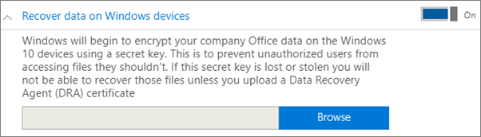
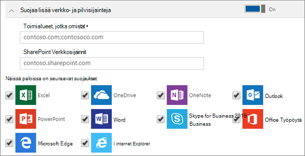

# Windows 10-laitteiden sovellusten suojaus asetusten määrittäminen tai muokkaaminenSet or edit application protection settings for Windows 10 devices

Tämä artikkeli koskee Microsoft 365 Business Premiumia.This article applies to Microsoft 365 Business Premium.

## Sovelluksen hallinta käytännön muokkaaminen Windows 10-sovelluksessaEdit an app management policy for Windows 10

1. Siirry hallinta keskukseen osoitteessa <a href="https://go.microsoft.com/fwlink/p/?linkid=837890" target="_blank">https://admin.microsoft.com</a> .Go to the admin center at <a href="https://go.microsoft.com/fwlink/p/?linkid=837890" target="_blank">https://admin.microsoft.com</a>.     
2. Valitse vasemmanpuoleisesta siirtymis ruudusta **laitteet** - \> **käytännöt** .On the left nav, choose **Devices** \> **Policies** .
1. Valitse aiemmin luotu Windows-sovellus käytännössä ja **Muokkaa**sitä.Choose an existing Windows app policy and then **Edit**.
1. Valitse **Muokkaa** sen asetus kohdan vierestä, jota haluat muuttaa, ja valitse sitten **Tallenna**.Choose **Edit** next to a setting you want to change and then **Save**.

## Windows 10:n sovellustenhallintakäytännön luominenCreate an app management policy for Windows 10

Jos käyttäjillä on henkilökohtaisia Windows 10 -laitteita, joissa he tekevät työtehtäviä, voit suojata tiedot myös kyseisissä laitteissa.If your users have personal Windows 10 devices on which they perform work tasks, you can protect your data on those devices as well.
  
1. Siirry hallinta keskukseen osoitteessa <a href="https://go.microsoft.com/fwlink/p/?linkid=837890" target="_blank">https://admin.microsoft.com</a> .Go to the admin center at <a href="https://go.microsoft.com/fwlink/p/?linkid=837890" target="_blank">https://admin.microsoft.com</a>. 
2. Valitse vasemmanpuoleisesta siirtymis ruudusta **laitteet** \> **käytännöt** \> **Lisää**.On the left nav, choose **Devices** \> **Policies** \> **Add**.
3. Kirjoita **Lisää käytäntö** -ruutuun yksilöivä nimi tälle käytännölle.On the **Add policy** pane, enter a unique name for this policy. 
4. Valitse **Käytännön tyyppi** -kohdassa **Windows 10:n sovellusten hallinta**.Under **Policy type**, choose **Application Management for Windows 10**.
5. Valitse **laite tyyppi**-kohdassa joko **henkilökohtainen** tai **yrityksen omistama**.Under **Device type**, choose either **Personal** or **Company Owned**.
6. **Salaa työtiedostot** otetaan automaattisesti käyttöön.The **Encrypt work files** is turned on automatically. 
7. Määritä **Estä käyttäjiä kopioimasta yritystietoja henkilökohtaisiin tiedostoihin ja pakota heidät tallentamaan työtiedostot OneDrive for Businessiin** **käyttöön**, jos et halua käyttäjien tallentavan työtiedostoja tietokoneeseensa.Set **Prevent users from copying company data to personal files and force them to save work files to OneDrive for Business** to **On** if you don't want the users to save work files on their PC. 
9. Laajenna **tietojen palauttaminen Windows-laitteissa**.Expand **Recover data on Windows devices**. Suosittelemme **, että otat sen käyttöön**.We recommend that you turn it **On**.
    Ennen kuin voit etsiä Tietojenpalautusagentti-varmenteen, sinun on ensin luotava se.Before you can browse to the location of the Data Recovery Agent certificate, you have to first create one. Lisä tietoja on artikkelissa EFS [(Encrypting File System)-tietojen palautus agentin (DRA) varmenteen luominen ja tarkistaminen](https://go.microsoft.com/fwlink/p/?linkid=853700).For instructions, see [Create and verify an Encrypting File System (EFS) Data Recovery Agent (DRA) certificate](https://go.microsoft.com/fwlink/p/?linkid=853700).
    
    Työtiedostot on oletusarvoisesti salattu salaisella avaimella, joka on tallennettu laitteeseen ja liitetty käyttäjän profiiliin.By default, work files are encrypted using a secret key that is stored on the device and associated with the user's profile. Vain käyttäjä itse voi avata tiedoston ja purkaa sen salauksen.Only the user can open and decrypt the file. Jos laite häviää tai jos käyttäjä poistetaan, tiedosto voi jäädä salattuun tilaan.However, if a device is lost or a user is removed, a file can be stuck in an encrypted state. Järjestelmänvalvoja voi purkaa tiedoston Sala uksen käyttämällä tietojen palautus agentti (DRA)-varmennetta.An admin can use the Data Recovery Agent (DRA) certificate to decrypt the file.
    
    
  
10. Laajenna **suojaa muita verkko-ja pilvi sijainteja** , jos haluat lisätä muita toimi alueita tai SharePoint Online-sijainteja varmistaaksesi, että kaikkien luettelossa olevien sovellusten tiedostot ovat suojattuja.Expand **Protect additional network and cloud locations** if you want to add additional domains or SharePoint Online locations to make sure that files in all the listed apps are protected. Jos sinun on annettava jompaankumpaan kenttään useita kohteita, lisää kohteiden väliin puolipiste (;).If you need to enter more than one item for either field, use a semicolon (;) between the items.
    
    
  
11. Päätä seuraavaksi, **ketkä saavat nämä asetukset**. Jos et halua käyttää oletusarvoista **Kaikki käyttäjät** -käyttöoikeusryhmää, valitse **Muuta** ja valitse käyttöoikeusryhmät, jotka saavat nämä asetukset \> **Valitse**.Next decide **Who will get these settings?** If you don't want to use the default **All Users** security group, choose **Change**, choose the security groups who will get these settings \> **Select**.
12. Lopuksi tallenna käytäntö valitsemalla **Lisää** ja määritä se laitteisiin.Finally, choose **Add** to save the policy, and assign it to devices. 
