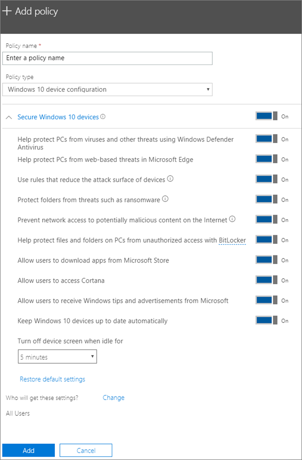

# Windows 10-tieto koneiden laite suojaus asetusten muokkaaminen tai luominenEdit or create device protection settings for Windows 10 PCs

Tämä artikkeli koskee Microsoft 365 Business Premiumia.This article applies to Microsoft 365 Business Premium.

Kun olet määrittänyt Määritä Windowsin oletusarvoiset suojaus asetukset asetus sivulle, voit lisätä uusia käyttäjiä, jotka koskevat joko kaikki käyttäjät tai käyttäjä joukkoa.After you have set set up default Windows protection settings on the Setup page, you can add new ones that apply to either all users, or a set of users. Voit myös muokata itse luomiasi.You can also edit any of the ones you have created.

## Windows 10-laitteiden suojaus asetusten luominenCreate protection settings for Windows 10 devices

Katso video Windows 10-laitteiden suojaamisesta Microsoft 365 Business Premiumin avulla:View a video on how to secure Windows 10 devices with Microsoft 365 Business Premium:
  
> [!VIDEO https://www.microsoft.com/videoplayer/embed/a5734146-620a-4cec-8618-536b3ca37972?autoplay=false]
  
1. Siirry hallinta keskukseen osoitteessa <a href="https://go.microsoft.com/fwlink/p/?linkid=837890" target="_blank">https://admin.microsoft.com</a> .Go to the admin center at <a href="https://go.microsoft.com/fwlink/p/?linkid=837890" target="_blank">https://admin.microsoft.com</a>. 
2. Valitse vasemmanpuoleisesta siirtymis ruudusta **laitteet** \> **käytännöt** \> **Lisää**.On the left nav, choose **Devices** \> **Policies** \> **Add**.
3. Kirjoita **Lisää käytäntö** -ruutuun yksilöivä nimi tälle käytännölle.On the **Add policy** pane, enter a unique name for this policy. 
4. Valitse **Käytäntötyyppi**, valitse **Windows 10 -laitteen määritys**.Under **Policy type**, choose **Windows 10 Device Configuration**.
5. Laajenna **Suojatut Windows 10 -laitteet** \> määritä haluamasi asetukset.Expand **Secure Windows 10 Devices** \> configure the settings how you would like. Lisä tietoja on kohdassa [käytettävissä olevat asetukset](#available-settings).For more information, see [Available settings](#available-settings). 
    
    Voit aina palauttaa oletusasetuksen **Oletusasetusten palauttaminen** -linkin avulla.You can always use the **Reset default settings** link to return to the default setting. 
    
    
  
6. Päätä seuraavaksi, **ketkä saavat nämä asetukset**. Jos et halua käyttää oletusarvoista **Kaikki käyttäjät** -käyttöoikeusryhmää, valitse **Muuta** ja etsi käyttöoikeusryhmä, joka saa nämä asetukset \> **Valitse**.Next decide **Who will get these settings?** If you don't want to use the default **All users** security group, Choose **Change**, search for the security group who will get these settings \> **Select**.
7. Lopuksi tallenna käytäntö valitsemalla **Valmis** ja määritä se laitteisiin.Finally, choose **Done** to save the policy, and assign it to devices. 

## Windows 10-suojaus asetusten muokkaaminenEdit Windows 10 protection settings
 
1. Siirry hallinta keskukseen osoitteessa <a href="https://go.microsoft.com/fwlink/p/?linkid=837890" target="_blank">https://admin.microsoft.com</a> .Go to the admin center at <a href="https://go.microsoft.com/fwlink/p/?linkid=837890" target="_blank">https://admin.microsoft.com</a>.     
2. Valitse vasemmanpuoleisesta siirtymis ruudusta **laitteet** - \> **käytännöt** .On the left nav, choose **Devices** \> **Policies** .
1. Valitse aiemmin luotu Windows-laite käytännöt ja **Muokkaa**niitä.Choose an existing Windows device policy and then **Edit**.
1. Valitse **Muokkaa** sen asetus kohdan vierestä, jota haluat muuttaa, ja valitse sitten **Tallenna**.Choose **Edit** next to a setting you want to change and then **Save**.

## Käytettävissä olevat asetuksetAvailable settings

Kaikki asetukset ovat oletusarvoisesti **käytössä**.By default all settings are **On**. Seuraavat asetukset ovat käytettävissä.The following settings are available.
  
Lisä tietoja on kohdassa [miten Microsoft 365 Premium Map-sovelluksen suojaus ominaisuudet ovat Intune-asetuksiin](map-protection-features-to-intune-settings.md).For more information, see [How do protection features in Microsoft 365 Premium map to Intune settings](map-protection-features-to-intune-settings.md). 
  
|||
|:-----|:-----|
|AsetusSetting    |KuvausDescription    |
|Auta suojaamaan tietokoneitasi viruksilta ja muilta uhkilta käyttämällä Windows Defenderin virustenorjuntaaHelp protect PCs from viruses and other threats using Windows Defender Antivirus    |Edellyttää, että Windows Defenderin virustentorjunta on otettu käyttöön suojaamaan tietokoneita Internetiin yhdistämisen vaaralta.Requires that Windows Defender Antivirus is turned on to protect PCs from the dangers of being connected to the internet.    |
|Auta suojaamaan tietokoneitasi verkkopohjaisilta uhkilta Microsoft EdgessäHelp protect PCs from web-based threats in Microsoft Edge    |Ottaa käyttöön Edgen asetukset, jotka auttavat suojaamaan käyttäjiä vahingollisilta sivustoilta ja latauksilta.Turns on settings in Edge that help protect users from malicious sites and downloads.    |
|Käytä sääntöjä, jotka pienentävät laitteiden hyökkäyspinta-alaaUse rules that reduce the attack surface of devices    |Kun tämä asetus käytössä, hyökkäyspinta-alan pienentäminen estää toiminnot ja sovellukset, joita haittaohjelmat yleensä käyttävät laitteiden saastuttamiseen. Tämä asetus on käytettävissä vain, jos Windows Defenderin virustentorjunta on käytössä. Lisätietoja on artikkelissa [Hyökkäyspinta-alan pienentäminen](https://docs.microsoft.com/windows/security/threat-protection/microsoft-defender-atp/exploit-protection).  When turned On, attack surface reduction helps block actions and apps typically used by malware to infect devices. This setting is only available if Windows Defender Antivirus is set to On. See [Reduce attack surfaces](https://docs.microsoft.com/windows/security/threat-protection/microsoft-defender-atp/exploit-protection) to learn more.    |
|Suojaa kansiot kiristysohjelmilta ja muilta uhiltaProtect folders from threats such as ransomware    |Tämä asetus hyödyntää hallittua kansioiden käyttöä, jolla yrityksen data suojataan epäilyttävien tai haitallisten sovellusten, kuten kiristysohjelmien, tekemiltä muutoksilta.This setting uses controlled folder access to protect company data from modification by suspicious or malicious apps, such as ransomware. Tällaisia sovelluksia estetään tekemästä muutoksia suojattuihin kansioihin.These types of apps are blocked from making changes in protected folders. Tämä asetus on käytettävissä vain, jos Windows Defenderin virustentorjunta on käytössä.This setting is only available if Windows Defender Antivirus is set to On. Lisä tietoja [on artikkelissa kansioiden suojaaminen hallitsevalta kansiolla on käytettävissä](https://docs.microsoft.com/mem/configmgr/protect/deploy-use/create-deploy-exploit-guard-policy#bkmk_CFA) .See [Protect folders with Controlled folder access](https://docs.microsoft.com/mem/configmgr/protect/deploy-use/create-deploy-exploit-guard-policy#bkmk_CFA) to learn more.    |
|Estä potentiaalisesti haitallisen sisällön käyttäminen InternetissäPrevent network access to potentially malicious content on the Internet    |Tämän asetuksen avulla voit estää lähtevien käyttäjien yhteydet heikkomaineiseen Internet-sijainteihin, jotka voivat isännöidä tietojenkalasteluhuijauksia, heikkoutta tai muuta haitallista sisältöä.Use this setting to block outbound user connections to low-reputation Internet locations that may host phishing scams, exploits, or other malicious content. Tämä asetus on käytettävissä vain, jos Windows Defender anti virus-asetuksena on **käytössä**.This setting is only available if Windows Defender Antivirus is set to **On**. Lisä tietoja on Ohje aiheessa [verkon suojaaminen](https://docs.microsoft.com/windows/security/threat-protection/windows-defender-antivirus/configure-real-time-protection-windows-defender-antivirus).For more information, see [Protect your network](https://docs.microsoft.com/windows/security/threat-protection/windows-defender-antivirus/configure-real-time-protection-windows-defender-antivirus).    |
|Suojaa tietokoneiden tiedostot ja kansiot luvattomalta käytöltä BitLockerillaHelp protect files and folders on PCs from unauthorized access with BitLocker    |BitLocker suojaa datan salaamalla tietokoneen kiintolevyt ja estämällä sen joutumisen vääriin käsiin, jos tietokone katoaa tai varastetaan.Bitlocker protects data by encrypting the computer hard drives and protect against data exposure if a computer is lost or stolen. Lisä tietoja on kohdassa [BitLocker-usein kysytyt kysymykset](https://go.microsoft.com/fwlink/?linkid=871000).For more information, see [Bitlocker FAQ](https://go.microsoft.com/fwlink/?linkid=871000).    |
|Salli käyttäjille sovellusten lataaminen Microsoft StorestaAllow users to download apps from Microsoft Store    |Sallii käyttäjien ladata ja asentaa sovelluksia Microsoft Storesta. Sovellukset vaihtelevat peleistä tuottavuustyökaluihin, joten asetus on **käytössä**, mutta voit poistaa sen käytöstä lisäsuojausta varten.  Lets users download and install apps from the Microsoft Store. Apps include everything from games to productivity tools, so we leave this setting **On**, but you can turn it off for extra security.    |
|Salli käyttäjien käyttää CortanaaAllow users to access Cortana    |Cortana-toiminto voi olla hyvin hyödyllinen.Cortana can be very helpful! Cortana voi ottaa asetuksia käyttöön tai poistaa sen käytöstä, antaa ohjeita ja varmistaa, että tapaamiset ovat ajan tasalla, joten pidämme tämän asetuksen oletusarvoisesti **käytössä** .Cortana can turn settings on or off for you, give directions, and make sure you're on time for appointments, so we keep this setting **On** by default.    |
|Salli käyttäjille Windows-vihjeiden ja -mainosten vastaanottaminen MicrosoftiltaAllow users to receive Windows tips and advertisements from Microsoft    |Windows-vihjeet voivat olla käteviä ja auttaa perehdyttämään käyttäjiä, kun uusia ominaisuuksia julkaistaan.Windows tips can be handy and help orient users when new features are released.    |
|Pidä Windows 10 -laitteet ajan tasalla automaattisestiKeep Windows 10 devices up to date automatically    |Varmistaa, että Windows 10 -laitteet vastaanottavat automaattisesti päivityksiä.Makes sure that Windows 10 devices automatically receive the latest updates.    |
|Sammuta laitteen näyttö, kun se on ollut käyttämättömänä tämän verranTurn off device screen when idle for this amount of time    |Varmistaa, että yritystiedot on suojattu, jos käyttäjä ei tee mitään. Käyttäjä saattaa työskennellä julkisessa paikassa, kuten kahvilassa, ja poistua tai kääntää huomion pois hetkeksi, jolloin laite on alttiina satunnaisille katseille. Tällä asetuksella voit määrittää, miten kauan käyttäjä voi olla toimettomana, ennen kuin näyttö pimenee.Makes sure that company data is protected if a user is idle. A user may be working in a public location, like a coffee shop, and step away or be distracted for just a moment, leaving their device vulnerable to random glances. This setting lets you control how long the user can be idle before the screen shuts off.    |
