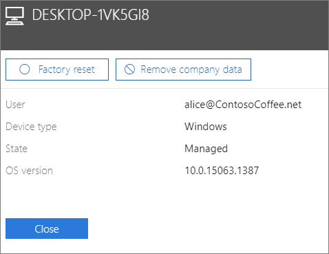

# Yritystietojen poistaminen laitteista

## Poista yritystiedot

Microsoft 365 for Businessin avulla voit poistaa käyttäjien [laitteiden](app-protection-settings-for-android-and-ios.md) tai Microsoft 365:n suojaamien [Windows-tietokoneiden](protection-settings-for-windows-10-devices.md) yritystiedot. **Jos poistat yritystiedot laitteesta, et voi palauttaa niitä myöhemmin**. 
  
1. Siirry hallintakeskukseen osoitteessa <a href="https://go.microsoft.com/fwlink/p/?linkid=837890" target="_blank">https://admin.microsoft.com</a>.
    
2. Valitse vasemmasta siirtymisruudusta **Laitteiden** \> **hallinta**.  
  
3. Valitse **Hallinta-sivulla** käyttäjä, jonka tiedot haluat poistaa, ja valitse nimi. 
    
4. Valitse laite tai laitteet seuraavan ruudun **Laitteet-luettelosta.** Avautuvan laiteruudun laiteruudussa voit valita, että laite palautetaan tehdasasetuksiin tai yrityksen tiedot poistetaan laitteen tyypin mukaan. 
    
    
  
5. Valitse vahvistusruudussa **Vahvista** \> **sulkeminen**.
    

