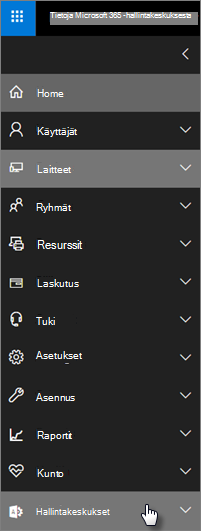

# Microsoft 365 Business Premiumin turvallisuus-ja yhteensopivuus ominaisuudetMicrosoft 365 Business Premium security and compliance features

Microsoft 365 Business Premium tarjoaa yksinkertaistettuja suojaus ominaisuuksia, jotka suojaavat tietoja tieto koneilla, puhelimilla ja tableteilla.Microsoft 365 Business Premium offers simplified security features to help safeguard your data on PCs, phones, and tablets.
    
## Microsoft 365-hallinta keskuksen käyttö oikeus ominaisuudetMicrosoft 365 admin center security features

Voit hallita monia Microsoft 365 Business Premium-tieto turva ominaisuuksia hallinta keskuksessa, jonka avulla voit ottaa nämä ominaisuudet käyttöön tai poistaa ne käytöstä yksinkertaisella tavalla.You can manage many of the Microsoft 365 Business Premium security features in the admin center, which gives you a simplified way to turn these features on or off. Hallinta keskuksessa voit tehdä seuraavat toimet:In the admin center, you can do the following:
  
- [Sovellusten hallinta-asetusten määrittäminen Android-tai iOS-laitteille](app-protection-settings-for-android-and-ios.md) .[Set application management settings for Android or iOS devices](app-protection-settings-for-android-and-ios.md) . 
    
    Nämä asetukset sisältävät tiedostojen poistamisen käyttämättömästä laitteesta tietyn vaiheen jälkeen, salattaessa työtiedostoja, vaatimalla käyttäjiä määrittämään PIN-tunnuksen ja niin edelleen.These settings include deleting files from an inactive device after a set period, encrypting work files, requiring that users set a PIN, and so on.
    
- [Sovellusten suojaus asetusten määrittäminen Windows 10-laitteille](protection-settings-for-windows-10-devices.md) .[Set application protection settings for Windows 10 devices](protection-settings-for-windows-10-devices.md) . 
    
    Näitä asetuksia voidaan käyttää yrityksen tietoihin sekä yrityksen omistamissa että itse omistamissa laitteissa.These settings can be applied to company data on both company-owned, or personally owned devices.
    
- [Laitteen suojaus asetusten määrittäminen Windows 10-laitteille](protection-settings-for-windows-10-pcs.md) .[Set device protection settings for Windows 10 devices](protection-settings-for-windows-10-pcs.md) . 
    
    Voit ottaa [BitLocker](https://go.microsoft.com/fwlink/p/?linkid=871405) -Sala uksen käyttöön, jos haluat suojata tietoja, jos laite katoaa tai varastetaan, ja ottaa käyttöön [Windows Exploit Guard](https://docs.microsoft.com/windows/security/threat-protection/microsoft-defender-atp/enable-exploit-protection) -suoja uksen, joka antaa kehittyneen suojan kiristys laitteita vastaan.You can enable [BitLocker](https://go.microsoft.com/fwlink/p/?linkid=871405) encryption to help protect data in case a device is lost or stolen, and enable [Windows Exploit Guard](https://docs.microsoft.com/windows/security/threat-protection/microsoft-defender-atp/enable-exploit-protection) to provide advanced protection against ransomware. 
    
- [Yritystietojen poistaminen laitteistaRemove company data from devices](remove-company-data.md)
    
    Voit pyyhkiä yrityksen tiedot etänä, jos laite katoaa, varastetaan tai työn tekijä lähtee yrityksestä.You can remotely wipe company data if a device is lost, stolen, or an employee leaves your company.
    
- [Palauta Windows 10-laitteet tehdas asetuksiksi](reset-devices-to-factory-settings.md) .[Reset Windows 10 devices to their factory settings](reset-devices-to-factory-settings.md) . 
    
    Voit palauttaa kaikki Windows 10-laitteet, joissa on käytössä laitteen suojaus asetukset.You can reset any Windows 10 devices that have device protection settings applied to them.
    
## Muut suojaustoiminnotAdditional security features 

Microsoft 365 Business Premiumin lisä ominaisuuksia on saatavilla, jotka auttavat suojaamaan yritystäsi tieto verkko uhilta ja turvaamaan luottamukselliset tiedot.Advanced features in Microsoft 365 Business Premium are available to help you protect your business against cyber-threats and safeguard sensitive information.
  
- **[Office 365 Advanced Threat-suojaus](https://docs.microsoft.com/microsoft-365/security/office-365-security/office-365-atp)****[Office 365 Advanced Threat Protection](https://docs.microsoft.com/microsoft-365/security/office-365-security/office-365-atp)**
    
    Advanced Threat Protectionin (ATP) avulla voit suojata yritystäsi kokeneilta tietojenkalastelulta ja kiristys ohjelmilta, jotka on suunniteltu työn tekijöiden tai asiakas tietojen vaarantamaan.Advanced Threat Protection (ATP) helps guard your business against sophisticated phishing and ransomware attacks designed to compromise employee or customer information. Ominaisuuksiin kuuluvat:Features include:
    
  - Hienostunut liitteiden tarkistus ja AI-käyttöinen analyysi vaarallisten viestien havaitsemiseksi ja hylkäämiseksi.Sophisticated attachment scanning and AI-powered analysis to detect and discard dangerous messages.
    
  - Sähkö postin linkkien automaattinen tarkistus, jos haluat arvioida, ovatko ne osa tietojenkalastelujärjestelmää.Automatic checks of links in email to assess if they're part of a phishing scheme. Tämä estää haitallisten sivustojen käytön.This keeps you safe from accessing unsafe websites.

- **[Intunen kaikki ominaisuudet Azure-portaalissa](https://go.microsoft.com/fwlink/p/?linkid=871403)****[The full capabilities of Intune in the Azure portal](https://go.microsoft.com/fwlink/p/?linkid=871403)**
    
    Kun käytät Intune-hallinta keskusta Azure-portaalissa, voit määrittää muita tieto turva ominaisuuksia, kuten Mac OS-laitteiden, iPhonen ja Android-laitteiden hallinnan sekä Windowsin kehittyneet laitteiden hallinta toiminnot, jotka eivät ole käytettävissä Microsoft 365-hallinta keskuksen kautta.Accessing the Intune admin center in the Azure portal allows you to set up additional security features, such as management of MacOS devices, iPhone, and Android devices, along with advanced device management for Windows, that aren't available through Microsoft 365 admin center.
- **Sama [Ehdollinen käyttäminen](https://docs.microsoft.com/azure/active-directory/conditional-access/overview) kuin Azure AD Premium P1-palvelu paketin****Same [Conditional Access](https://docs.microsoft.com/azure/active-directory/conditional-access/overview) as Azure AD Premium P1 plan**

    Ehdollinen käyttäminen voi auttaa suojaamaan organisaatiotasi kirjautumisriskeiltä, käyttämään odottamattomia verkkoja tai maa-asetuksia, käyttämään riskialttiiden laite tyyppien yrityksiä ja niin edelleen.Conditional Access can help protect your organization from sign-in risk, access attempts from an unexpected network or locale, access attempts from risky device types, and so on. Ehdollisen käytön käytännöt on pakotettu, kun ensimmäinen todennus on valmis, ja se käyttää ensimmäisen todennus tapahtuman signaaleja määrittääkseen, onko yritys käyttö oikeus hyväksyttävä, estetty vai tarvitaanko muita todisteita (kuten toinen tunniste).Conditional Access policies are enforced after the first authentication is completed, and it uses signals from the first authentication event to determine if the attempted access should be approved, denied, or if more proof (such as a second form of identification) is required.

    Ehdollisen käytön ominaisuuksiin sisältyvät seuraavat:The conditional access features included are:

    - Käyttäjä nimen, ryhmän ja roolin perusteellaAccess based on username, group, and role
    - [Sovellukseen perustuva](https://docs.microsoft.com/azure/active-directory/conditional-access/app-based-conditional-access) yhteysAccess [based on an app](https://docs.microsoft.com/azure/active-directory/conditional-access/app-based-conditional-access) 
    - [Käyttäminen sijainnin perusteella](https://docs.microsoft.com/azure/active-directory/authentication/howto-registration-mfa-sspr-combined#conditional-access-policies-for-combined-registration);  Salli vain luotettujen IP-alueiden tai tiettyjen maiden käyttäminen[Access based on location](https://docs.microsoft.com/azure/active-directory/authentication/howto-registration-mfa-sspr-combined#conditional-access-policies-for-combined-registration);  only allow access from trusted IP ranges or specific countries 
    - Edellytä MFA-käyttöä AccessissaRequire MFA for access
    - [Vanhaa todennusta](https://docs.microsoft.com/azure/active-directory/conditional-access/block-legacy-authentication) käyttävien sovellusten käytön estäminenBlock access to apps that use [legacy authentication](https://docs.microsoft.com/azure/active-directory/conditional-access/block-legacy-authentication)
    - Edellytä, että sovellus TP käyttää [Intune-sovelluksen suojausta](https://docs.microsoft.com/azure/active-directory/conditional-access/app-protection-based-conditional-access)Require apps tp use [Intune app protection](https://docs.microsoft.com/azure/active-directory/conditional-access/app-protection-based-conditional-access)
    - Mukautettu todennus, kuten MFA kolmannen osapuolen palveluntarjoajien kanssa, esimerkiksi DUO.Custom authentication such as MFA with third-party providers, for example DUO.
   
    Muita ominaisuuksia:Other features:
    - [Omatoiminen Sala sanan palautus](https://docs.microsoft.com/azure/active-directory/authentication/concept-sspr-customization) Hybrid Azure AD:hen[Self-service password reset](https://docs.microsoft.com/azure/active-directory/authentication/concept-sspr-customization) for hybrid Azure AD
    
## Yhteensopivuus ominaisuudetCompliance features

Microsoft 365 Business Premium-tilaukseesi sisältyy ominaisuuksia, jotka auttavat ylläpitämään vaatimustenmukaisuutta ja lain säädäntöä koskevia standardeja.Your Microsoft 365 Business Premium subscription includes features that help you maintain compliance and regulatory standards.

- **[Yleistä tietojen menetyksen esto käytännöistä](https://docs.microsoft.com/microsoft-365/compliance/data-loss-prevention-policies)** (DLP).**[Overview of data loss prevention policies](https://docs.microsoft.com/microsoft-365/compliance/data-loss-prevention-policies)** (DLP). 
    
    Voit määrittää DLP:N tunnistamaan automaattisesti luottamukselliset tiedot, kuten luotto kortti numerot ja sosiaaliturvatunnukset, jotta estetään niiden tahaton jakaminen yrityksen ulkopuolelta.You can set up DLP to automatically detect sensitive information, like credit card numbers, social security numbers, and so on, to prevent their inadvertent sharing outside your company.
    
- **[Exchange Online Archiving](https://products.office.com/exchange/microsoft-exchange-online-archiving-email)****[Exchange Online Archiving](https://products.office.com/exchange/microsoft-exchange-online-archiving-email)**
    
    Exchange Online-arkistointi käyttö oikeus mahdollistaa viestien helpon arkistoinnin jatkuvan tietojen varmuus kopioinnin avulla.Exchange Online Archiving license enables messages to be easily archived with continuous data backup. Se tallentaa kaikki käyttäjän sähkö postit, mukaan lukien poistetut kohteet, siinä tapa uksessa, että niitä tarvitaan myöhemmin löydöstä tai palauttamisesta.It stores all of a user's emails, including deleted items, in case they're needed later for discovery or restoration. Lisäksi voit käyttää erilaisia säilytys käytäntöjä Sähkö posti tietojen säilyttämiseen oikeus toimiin, eDiscoveryyn tai yhteensopivuus vaatimusten täyttämiseen.Additionally, you can use different retention policies to preserve email data for litigation holds, eDiscovery, or to meet compliance requirements.
    
- **[Luottamuksellisuusmerkinnät](https://docs.microsoft.com/microsoft-365/compliance/sensitivity-labels)****[Sensitivity labels](https://docs.microsoft.com/microsoft-365/compliance/sensitivity-labels)**

   Microsoft 365 Business Premium sisältää kaikki [Azuren tieto turva palvelu paketin 1](https://go.microsoft.com/fwlink/p/?linkid=871407)ominaisuudet.Microsoft 365 Business Premium includes all the features of [Azure Information Protection Plan 1](https://go.microsoft.com/fwlink/p/?linkid=871407). Tässä ohjelmassa voit luoda **Luottamuksellisuusotsikoita** , joiden avulla voit hallita sähkö postin ja asia kirjojen luottamuksellisten tietojen käyttö oikeuksia, esimerkiksi "Älä lähetä edelleen"-ja "Älä kopioi"-toimintoja.With this plan, you can create **Sensitivity labels** that allow you to control access to sensitive information in email and documents, with controls like "Do not forward" and "Do not copy." Voit myös luokitella luottamuksellisia tietoja luottamuksellisiksi ja määrittää, miten luokitellut tiedot voidaan jakaa yrityksen sisä-ja ulkopuolella.You can also classify sensitive information as "Confidential" and specify how classified information can be shared outside and inside the business. Yritys tason salausta on helppo käyttää sähkö postissa ja asia kirjoissa, jotta tietosi pysyvät yksityisinä.Enterprise-grade encryption is easy to apply to email and documents to keep your information private. Voit asentaa myös Azure Information Protectionin Client-apuohjelman Office-sovelluksiin.You can also install the Azure Information Protection client add-in for Office apps. Lisä tietoja on kohdassa [Azure Information Protectionin Unified-merkintä asiakas](https://docs.microsoft.com/azure/information-protection/rms-client/unifiedlabelingclient-version-release-history).For more information, see [Azure Information Protection unified labeling client](https://docs.microsoft.com/azure/information-protection/rms-client/unifiedlabelingclient-version-release-history). Jos kyseessä on herkkyys tarra, asenna **AzInfoProtection_UL.exe**.For Sensitivity labels, install the **AzInfoProtection_UL.exe**.

Voit hallita näitä ominaisuuksia tieto turvan &amp; yhteensopivuus keskuksessa ja Intune-hallinta keskuksessa.You can manage these features in the Security &amp; Compliance center and the Intune admin center. Ajan mittaan ne lisätään Microsoft 365-hallinta keskukseen.Over time the simplified controls will be added to the Microsoft 365 admin center.
  
    
## Usein kysytyt kysymyksetFAQ

 ### Ovatko nämä turva ominaisuudet saatavilla kaikilla markkinoilla?Are these security features available in all markets?
  
Kyllä, nämä ominaisuudet ovat käytettävissä kaikilla markkinoilla, joilla Microsoft 365 Business Premium on myynnissä.Yes, these features are available in all markets where Microsoft 365 Business Premium is sold.
  
### Miten löydän tieto turvan &amp; yhteensopivuus keskuksen?How do I find the Security &amp; Compliance center?
  
1. [Kirjaudu sisään Microsoft 365 Business Premiumiin](https://portal.microsoft.com/) järjestelmänvalvojan tunniste tiedoilla.[Sign in to Microsoft 365 Business Premium](https://portal.microsoft.com/) by using your admin credentials. 
    
2. Etsi vasemmasta siirtymis ruudusta **hallinta keskukset** ja laajenna se.In the left nav, locate **Admin centers** and expand it. 
    
    
  
3. Valitse **tieto &amp; turva yhteensopivuus,** jos haluat siirtyä tieto turvan &amp; yhteensopivuus keskukseen.Choose **Security &amp; Compliance** to go to Security &amp; compliance center.
