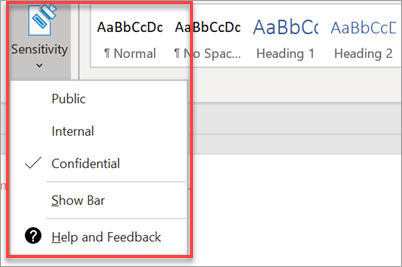

# Yhteensopivuusominaisuuksien määritäminen

Microsoft 365 Business Premium sisältää ominaisuuksia, jotka suojaavat tietojasi ja laitteitasi ja auttavat sinua pitämään asiakkaidesi ja asiakkaidesi luottamukselliset tiedot turvassa.

## DLP-ominaisuuksien asetusten täytäminen

Katso [mallista DLP-käytännön](../compliance/create-a-dlp-policy-from-a-template.md) luominen esimerkiksi siitä, miten voit määrittää käytännön, joka suojaa henkilökohtaisten tietojen menetykseltä. 
  
DLP sisältää useita käyttövalmiita käytäntömalleja useille eri kielille. Esimerkiksi Australia Financial Data, Canada Personal Information Act, U.S. Financial Data ja niin edelleen. Katso, [mitkä DLP-käytäntömallit](../compliance/what-the-dlp-policy-templates-include.md) sisältävät täydellisen luettelon. Kaikki nämä mallit voidaan ottaa käyttöön samalla tavalla kuin PII-malliesimerkki. 
  
## Sähköpostin säilytyksen määrittäminen Exchange Online Archivingin avulla

 **Exchange Online Archiving** -käyttöoikeusominaisuudet auttavat säilyttämään vaatimustenmukaisuus- ja säädöstenmukaisuusstandardit säilyttämällä eDiscoveryn sähköpostisisällön. Se myös vähentää riskiäsi, jos oikeusjutun on olemassa, ja tarjoaa keinon tietojen palauttamiseen tietoturvarikkomuksen jälkeen tai silloin, kun haluat palauttaa poistetut kohteet. Voit säilyttää kaiken käyttäjän sisällön oikeus oikeushallintapitoa käyttämällä tai mukauttaa säilytyskäytäntöjen avulla sitä, mitä haluat säilyttää.
  
**Oikeusistuntoon pito:** Voit säilyttää postilaatikon kaiken sisällön poistetut kohteet mukaan lukien asettamalla käyttäjän koko postilaatikon oikeusistuntoon. 
    
Voit sijoittaa postilaatikon oikeusportaalin pitoon hallintakeskuksessa:
    
1. Valitse vasemmassa siirtymispalkin yläkulmassa **Käyttäjät,** \> **jotka ovat aktiivisia.**
    
2. Valitse käyttäjä, jonka postilaatikon haluat sijoittaa oikeusistuntoon. Laajenna käyttäjäruudussa **Sähköpostiasetukset ja valitse** Lisää asetuksia **-kohdassa** Muokkaa **Exchange-ominaisuuksia.**
    
3. Valitse käyttäjän postilaatikkosivulla ** postilaatikon ominaisuudet ** vasemmasta siirtymispalkin kohdasta ja valitse sitten Ota käyttöön -linkki **Oikeusmääräys-pito-kohdassa.** 
    
4. Voit määrittää **oikeus riitautuksen** pitovalintaikkunassa oikeusistuinten pitoajan keston oikeus oikeusistuinten **kestokentässä.** Jätä kenttä tyhjäksi, jos haluat sijoittaa äärettömän pitoon. Voit myös lisätä muistiinpanoja ja ohjata postilaatikon omistajan verkkosivustoon, jossa sinun on ehkä selitettävä lisää oikeus oikeusistuntoon liittyen. \>**Tallenna.**
    
**Säilytys:** Voit ottaa käyttöön mukautettuja säilytyskäytäntöjä, jos esimerkiksi haluat säilyttää tietyn ajan tai poistaa sisältöä pysyvästi säilytysajan lopussa. Lisätietoja on ohjeaiheessa [Säilytyskäytäntöjen yleiskatsaus.](../compliance/retention.md)

## Luottamuksellisuusotsikoiden valitseminen

Luottamuksellisuustunnisteet tulevat Azure Information Protection (AIP) -palvelupaketti 1:n mukana, ja ne auttavat luokittelemaan ja suojaamaan asiakirjojasi ja sähköpostejasi käyttämällä tarroja. Järjestelmänvalvojat, jotka määrittävät sääntöjä ja ehtoja, voivat ottaa selitteet käyttöön automaattisesti, käyttäjien manuaalisesti tai käyttämällä yhdistelmää, jossa käyttäjille annetaan suosituksia.

Jos haluat määrittää luottamuksellisuusotsikot, tarkastele [luottamuksellisuusotsikoiden luontia ja hallintaa](https://support.microsoft.com/office/2fb96b54-7dd2-4f0c-ac8d-170790d4b8b9) videossa.

### Azure Information Protection -asiakasohjelman asentaminen manuaalisesti

AIP-asiakasohjelman asentaminen manuaalisesti:

1. Lataa **AzinfoProtection_UL.exe** Microsoft [Download Centeristä.](https://www.microsoft.com/download/details.aspx?id=53018)
 
2. Voit tarkistaa, että asennus on toiminut tarkastelemalla Word-asiakirjaa ja varmistamalla, että Luottamuksellisuus-vaihtoehto  on käytettävissä **Aloitus-välilehdessä.**
 

Lisätietoja on kohdassa [Asiakkaan asentaminen.](/azure/information-protection/infoprotect-tutorial-step3)