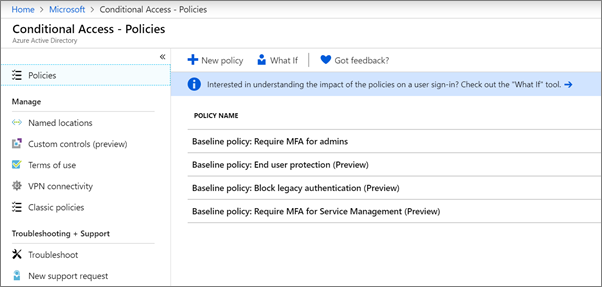

# Ehdollisen käytön käytäntöjen määrittäminen

[Ehdollisen käytön](https://docs.microsoft.com/azure/active-directory/conditional-access/overview) käytännöt lisäävät huomattavasti lisäsuojausta. Microsoft tarjoaa joukon perustason ehdollisia käyttökäytäntöjä, joita suositellaan kaikille asiakkaille. Perusaikataulun käytännöt ovat joukko ennalta määritettyjä käytäntöjä, jotka auttavat suojaamaan organisaatioita monilta yleisiltä hyökkäyksiltä. Näitä yleisiä hyökkäyksiä voivat olla salasanasuihke, uusinta ja tietojenkalastelu.

Nämä käytännöt edellyttävät, että järjestelmänvalvojat ja käyttäjät kirjoittavat toisen todennusmuodon (monivaiheinen todennus tai mfa), kun tietyt ehdot täyttyvät. Jos käyttäjä esimerkiksi kirjautuu sisään toisesta maasta, kirjautumista saatetaan pitää riskialttiina ja käyttäjän on annettava lisätodennusmuoto. 

Tällä hetkellä perustason käytäntöjä ovat seuraavat:
- **Vaadi mfa järjestelmänvalvojille** &ndash; Edellyttää monivaiheista todennusta etuoikeutetuimmille järjestelmänvalvojan rooleille, mukaan lukien yleinen järjestelmänvalvoja.
- **Loppukäyttäjän suojaus** &ndash; Edellyttää monivaiheista todennusta käyttäjille vain, kun kirjautuminen on riskialtista. 
- **Estä vanha todennus** &ndash; Vanhemmat asiakassovellukset ja jotkin uudet sovellukset eivät käytä uudempia, turvallisempia todennusprotokollia. Nämä vanhemmat sovellukset voivat ohittaa ehdollisen käytön käytännöt ja saada luvattoman pääsyn ympäristöösi. Tämä käytäntö estää pääsyn asiakkailta, jotka eivät tue ehdollista käyttöoikeutta. 
- **Vaadi mfa palvelunhallintaa** &ndash; edellyttää monivaiheista todennusta hallintatyökalujen, kuten Azure-portaalin (jossa perusaikataulun käytännöt määritetään). 

Microsoft suosittelee, että otat käyttöön kaikki nämä perusaikataulun käytännöt. Kun nämä käytännöt on otettu käyttöön, järjestelmänvalvojia ja käyttäjiä pyydetään rekisteröitymään Azure Multii-Factor -todennusta varten.

Lisätietoja näistä käytännöistä on ohjeaiheessa [Mitä ovat perustason käytännöt?](https://docs.microsoft.com/azure/active-directory/conditional-access/concept-baseline-protection)

## Perusaikataulun käytäntöjen määrittäminen

1. Siirry [Azure-portaaliin](https://portal.azure.com)ja siirry sitten **Azure Active Directoryn** \> **ehdolliseen käyttöön**.
    
    Perusaikataulun käytännöt näkyvät sivulla.    
    
1. Katso seuraavat tarkat ohjeet kustakin käytännöstä:

  - [Vaadi mfa ylläpitäjät](https://docs.microsoft.com/azure/active-directory/conditional-access/howto-baseline-protect-administrators)
- [Vaadi mfa käyttäjille](https://docs.microsoft.com/azure/active-directory/conditional-access/howto-baseline-protect-end-users)  
 - [Estä vanha todennus](https://docs.microsoft.com/azure/active-directory/conditional-access/howto-baseline-protect-legacy-auth)
  - [Vaadi mfa palvelunhallintaan](https://docs.microsoft.com/azure/active-directory/conditional-access/howto-baseline-protect-azure)

Voit määrittää useita lisäkäytäntöjä, kuten edellyttää hyväksyttyjä asiakassovelluksia. Lisätietoja on [ehdollisen käytön dokumentaatiossa](https://docs.microsoft.com/azure/active-directory/conditional-access/).
