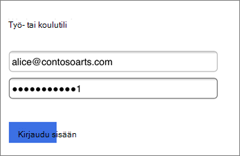
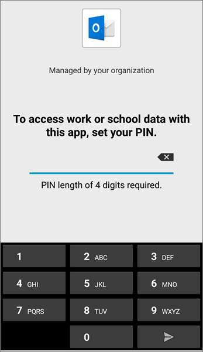

# Mobiililaitteiden Microsoft 365 yrityskäyttäjille

Asenna iPhone- tai Android-puhelimeen noudattamalla välilehtien asennusohjeita. Kun olet toiminut näiden ohjeiden mukaisesti, Office-sovelluksissa luodut työtiedostot suojataan Microsoft 365 yrityksille.

Esimerkki on Outlookista, mutta pätee myös kaikkiin muihin Office-sovelluksiiin, jotka haluat asentaa.
  
## Mobiililaitteiden määrittäminen

## [iPhone](#tab/iPhone)
  
Watch a short video on how to set up Office on iOS devices with Microsoft 365 for business.  

> [!VIDEO https://www.microsoft.com/videoplayer/embed/RWee2n] 

Jos tämä video on mielestäsi hyödyllinen, tutustu [täydelliseen koulutussarjaan pienyrityksille ja uusille Microsoft 365 -käyttäjille](../business-video/index.yml).

Siirry **App Store** -kauppaan ja kirjoita hakukenttään Microsoft Outlook.
  

  
Asenna Outlook napauttamalla pilvikuvaketta.
  

  
Kun asennus on valmis, avaa Outlook valitsemalla **Avaa**-painike ja valitse sitten **Aloittaminen**.
  

  
Kirjoita työsähköpostiosoitteesi Lisää sähköpostitili **-näytössä** Lisää tili ja kirjoita sitten \> Microsoft 365 yrityksen tunnistetiedot \> **Kirjaudu sisään**.
  

  
Jos organisaatio suojaa sovellusten tiedostoja, näkyviin tulee valintaikkuna, jossa kerrot, että organisaatio suojaa nyt sovelluksen tietoja, ja sinun on käynnistettävä sovellus uudelleen, jotta voit jatkaa sen käyttöä. Valitse **OK** ja sulje Outlook. 
  

  
Etsi Outlook iPhone-puhelimessa ja käynnistä se uudelleen. Kirjoita pyydettäessä PIN-koodi ja vahvista se. iPhone-puhelimesi Outlook on nyt valmis käytettäväksi.
  

  
## [Android](#tab/Android)
  
Katso video Android-Outlook Office asentamisesta.  

> [!VIDEO https://www.microsoft.com/videoplayer/embed/ecc2e9c0-bc7e-4f26-8b14-91d84dbcfef0] 

Jos tämä video on mielestäsi hyödyllinen, tutustu [täydelliseen koulutussarjaan pienyrityksille ja uusille Microsoft 365 -käyttäjille](../business-video/index.yml).

Aloita määritys Android-puhelimessa play-kaupasta.
  

  
Kirjoita Microsoft Outlook Google Play -hakuruutuun ja valitse **Asenna**. Kun Outlook asennus on valmis, valitse **Avaa**.
  

  
Valitse Outlook -sovelluksessa **Aloitusopas**, lisää Microsoft 365 for Business -sähköpostitili Jatka ja kirjaudu sisään \> organisaation tunnistetiedoilla.
  

  
Valitse **Siirry Kauppaan** valintaikkunassa, joka kehottaa asentamaan Intune-yritysportaalin.
  

  
Asenna Sovellus Play Kaupasta Intune-yritysportaali.
  

  
Avaa Outlook uudelleen ja anna ja vahvista PIN-koodi. Outlook-sovellus on nyt valmis käytettäväksi.
  

## Tutustu myös seuraaviin ohjeartikkeleihin:

[Microsoft 365 yrityksille -koulutusvideoita](../business-video/index.yml)

---
