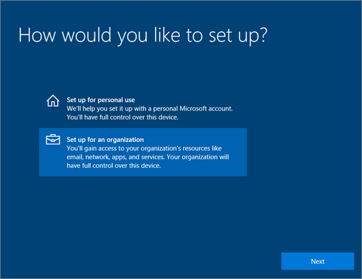
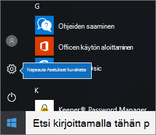
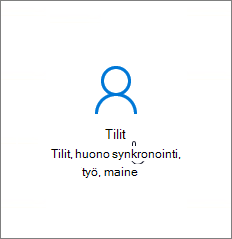
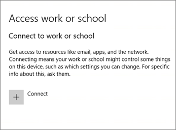
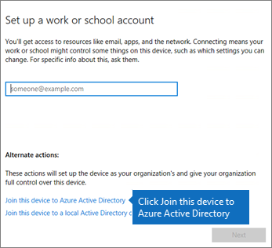
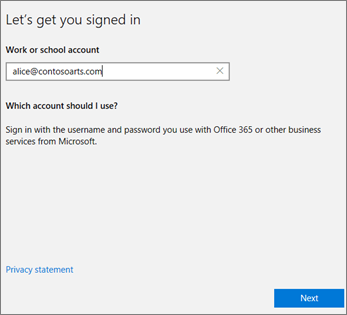
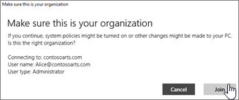
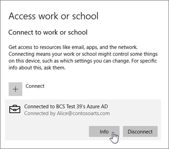
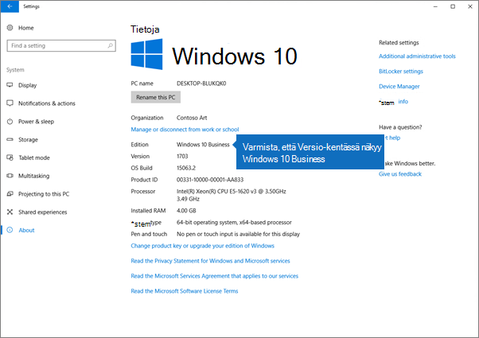

# Laitteiden Windows käyttäjien Microsoft 365 Business Premium käyttöön

## Laitteiden määrittämisen edellytykset Windows käyttäjille Microsoft 365 Business Premium käyttäjille

Ennen kuin voit määrittää Windows -Microsoft 365 Business Premium käyttäjille, varmista, että kaikissa Windows -laitteissa Windows 10 Pro versio 1703 (Creators-päivitys). Windows 10 Pro käyttöönotto edellyttää Windows 10 Business:n käyttöönottoa. Se on joukko pilvipalveluja ja laitteiden hallintaominaisuuksia, jotka täydentävät Windows 10 Pro ja mahdollistavat Microsoft 365 Business Premium:
  
Jos Windows on Windows 7 Pro-, Windows 8 Pro- tai Windows 8.1 Pro-käyttöjärjestelmä, Microsoft 365 Business Premium oikeuttaa sinut Windows 10 päivitykseen.
  
Lisätietoja Windows-laitteiden Windows 10 Pro Creators -päivityksen tekemisestä on tämän aiheen ohjeissa: [Windows Pro Creators -päivityksen tekeminen Windows-laitteisiin](upgrade-to-windows-pro-creators-update.md).
  
Voit [tarkistaa päivityksen toimiminen tai varmistaa,](#verify-the-device-is-connected-to-azure-ad) että laite on yhdistetty Azure AD:iin kohdassa Laitteen Azure AD-yhteyden tarkistaminen.

Katso lyhyt video yhteyden muodostamisesta Windows Microsoft 365.  

> [!VIDEO https://www.microsoft.com/videoplayer/embed/RE3yXh3] 

Jos tämä video on mielestäsi hyödyllinen, tutustu [täydelliseen koulutussarjaan pienyrityksille ja uusille Microsoft 365 -käyttäjille](../business-video/index.yml).
  
## Windows 10 -laitteiden liittäminen organisaatiosi Azure AD:hen

Kun Windows kaikki organisaatiosi laitteet on joko päivitetty Windows 10 Pro Creators -päivitykseen tai ne ovat jo Windows 10 Pro Creators -päivitystä, voit liittää nämä laitteet organisaatiosi Azure Active Directory. Kun laitteet on liitetty, ne päivitetään automaattisesti Windows 10 Business, joka on osa Microsoft 365 Business Premium tilaustasi.
  
### Uusi tai päivitetty Windows 10 Pro -laite

Jos laite on uusi laite, jossa on Windows 10 Pro Creators -päivitys, tai laitteeseen on tehty Windows 10 Pro Creators -päivitys, mutta ei vielä Windows 10 -laitemääritystä, noudata seuraavia ohjeita.
  
1. Suorita Windows 10 -laitteen asennus, kunnes näyttöön tulee **Miten haluat määrittää?** -sivu. 
    
    
  
2. Valitse tässä **Määritä organisaatiolle ja** kirjoita sitten organisaation käyttäjänimi ja Microsoft 365 Business Premium. 
    
3. Viimeistele Windows 10 -laitteen määritys.
    
   Kun olet valmis, käyttäjä yhdistetään organisaatiosi Azure AD:hen. Varmista tämä kohdan [Laitteen Azure AD -yhteyden tarkistaminen](#verify-the-device-is-connected-to-azure-ad) ohjeiden mukaan. 
  
### Laite, joka on jo määritetty ja jossa on Windows 10 Pro

 **Käyttäjien yhdistäminen Azure AD:hen:**
  
1. Valitse käyttäjän Windows-tietokoneessa, jossa on käytössä Windows 10 Pro -versio 1703 (Creators-päivitys) (katso [edellytykset](pre-requisites-for-data-protection.md)), Windows-näppäin ja valitse sitten Asetukset-kuvake.
  
   
  
2. Vallitse **Asetukset** ja valitse sitten **Tilit**.
  
   
  
3. Valitse **Omat tiedot** -sivulla **Käytä työpaikan tai koulun resursseja** \> **Yhdistä**.
  
   
  
4. Valitse **Määritä työpaikan tai oppilaitoksen tili** -valintaikkunan **Vaihtoehtoiset toimet** -kohdassa **Liitä tämä laite Azure Active Directoryyn**.
  
   
  
5. Kirjoita **Kirjaudu sisään** -sivulla työpaikan tai oppilaitoksen tili \> **Seuraava**.
  
   Kirjoita salasana **Anna salasana** -sivulla \> **Kirjaudu**.
  
   
  
6. Varmista **Varmista, että tämä on organisaatiosi** -sivulla, että tiedot ovat oikein, ja valitse **Liity**.
  
   Valitse **Olet valmis!** -sivu, chosse **Valmis**.
  
   
  
Jos olet ladannut tiedostoja OneDrive for Businessiin, synkronoi ne takaisin. Jos käytit kolmannen osapuolen työkalua profiilin ja tiedostojen siirtämiseen, myös ne synkronoidaan uuteen profiiliin.
  
## Laitteen Azure AD -yhteyden tarkistaminen

Voit tarkistaa synkronoinnin tilan valitsemalla **Accessin** työ- tai koulusivulla **Asetukset** **_,** jotta näet painikkeet Tiedot ja Katkaise \<organization name\> **yhteys**  . Saat **synkronoinnin** tilan valitsemalla Tiedot. 
  
Valitse **Synkronoinnin tila** -sivulla **Synkronoi,** jotta saat uusimmat mobiililaitteiden hallintakäytännöt tietokoneeseen.
  
Jos haluat aloittaa Microsoft 365 Business Premium tilin käytön, siirry aloituspainikkeeseen Windows aloituspainike, napsauta nykyisen tilisi kuvaa hiiren kakkospainikkeella ja valitse **Sitten Vaihda tili**.  Kirjaudu sisään käyttämällä organisaatiosi sähköpostiosoitetta ja salasanaa.
  

  
## Varmista, että tietokone on päivitetty Windows 10 Business

Varmista, että Azure AD:Windows 10 liitettyihin laitteisiin on Windows 10 Business osana Microsoft 365 Business Premium tilaustasi.
  
1. Valitse **Asetukset** \> **Järjestelmä** \> **Tietoja**.
    
2. Varmista, että **Julkaisu**-kohdassa lukee **Windows 10 Business**.
    
    
  
## Seuraavat vaiheet

Jos haluat määrittää mobiililaitteet, katso mobiililaitteiden Microsoft 365 Business Premium [-käyttäjille](set-up-mobile-devices.md). Lisätietoja laitteiden tai sovellusten suojauskäytäntöjen määrittämiskäytännöistä on kohdassa [Microsoft 365 yrityskäyttäjien tietojen hallinta.](manage.md)
  
## Lisätietoja asetusten määrittämisestä ja Microsoft 365 Business Premium

[Microsoft 365 yrityksille -koulutusvideoita](../business-video/index.yml)
