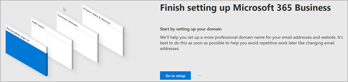
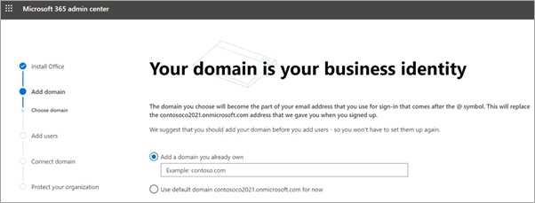
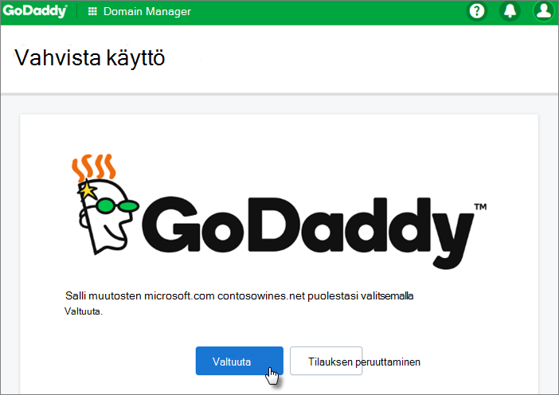
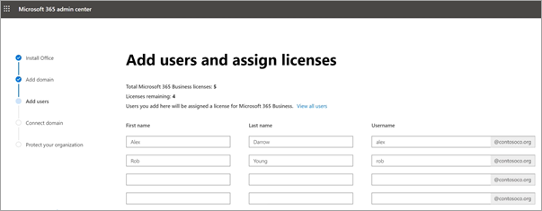
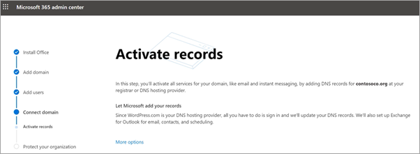
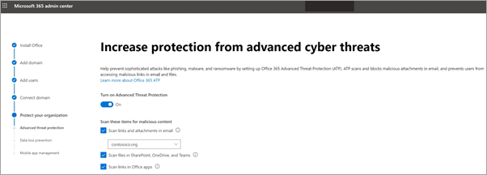
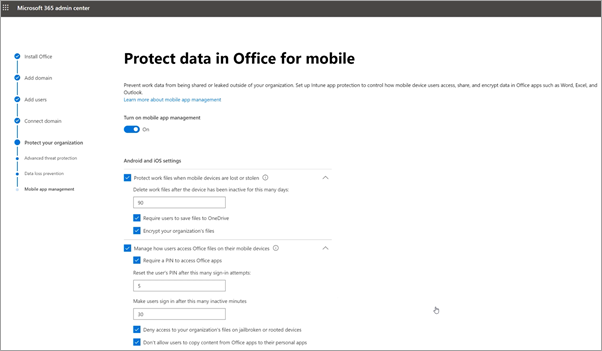

# Microsoft 365 Businessin määrittäminen ohjatussa asennustoiminnossaSet up Microsoft 365 Business in the setup wizard

Tämä video on yleiskuvaus Microsoft 365 Businessin asennuksesta.Watch this video for an overview of Microsoft 365 Business setup.  

> [!VIDEO https://www.microsoft.com/videoplayer/embed/RE1FYSM] 

Jos tämä video on mielestäsi hyödyllinen, tutustu [täydelliseen koulutussarjaan pienyrityksille ja uusille Microsoft 365 -käyttäjille](https://support.office.com/article/6ab4bbcd-79cf-4000-a0bd-d42ce4d12816).If you found this video helpful, check out the [complete training series for small businesses and those new to Microsoft 365](https://support.office.com/article/6ab4bbcd-79cf-4000-a0bd-d42ce4d12816).

## Toimialueen, käyttäjien ja käytäntöjen määrittäminenAdd your domain, users, and set up policies

Kun ostat Microsoft 365 Businessin, voit käyttää omistamaasi toimialuetta tai ostaa sen [rekisteröitymisen](sign-up.md)aikana.When you purchase Microsoft 365 Business, you have the option of using a domain you own, or buying one during the [sign-up](sign-up.md).

- Jos ostit uuden toimialueen rekisteröityessäsi, toimialueesi on määritetty ja voit siirtyä [Lisää käyttäjiä -kohtaan ja määrittää käyttöoikeuksia](#add-users-and-assign-licenses).If you purchased a new domain when you signed up, your domain is all set up and you can move to [Add users and assign licenses](#add-users-and-assign-licenses).

### Toimialueen lisääminen kirjautumisen mukauttamiseksiAdd your domain to personalize sign-in

1. Kirjaudu [Microsoft 365 -hallintakeskukseen](https://admin.microsoft.com) käyttämällä yleisiä järjestelmänvalvojan tunnistetietoja.Sign in to [Microsoft 365 admin center](https://admin.microsoft.com) by using your global admin credentials. 

2. Käynnistä ohjattu toiminto valitsemalla **Siirry asennukseen.**Choose **Go to setup** to start the wizard.

    

3. Asenna **Office-sovellukset -sivulla** voit halutessasi asentaa sovellukset omaan tietokoneeseesi.On the **Install your Office apps** page, you can optionally install the apps on your own computer.
    
4. Kirjoita **Lisää toimialue** -vaiheeseen haluamasi toimialueen nimi (kuten contoso.com).In the **Add domain** step, enter the domain name you want to use (like contoso.com).

    > [!IMPORTANT]
    > Jos ostit toimialueen rekisteröitymisen aikana, lisää **toimialuevaihe** ei näy tässä.If you purchased a domain during the sign-up, you will not see **Add a domain** step here. Siirry sen sijaan [kohtaan Käyttäjien lisääminen.](#add-users-and-assign-licenses)Go to [Add users ](#add-users-and-assign-licenses) instead.

    

    
4. Luo [DNS-tietueita missä tahansa Office 365:n DNS-isännöintipalvelussa](https://docs.microsoft.com/office365/admin/get-help-with-domains/create-dns-records-at-any-dns-hosting-provider) ohjatun toiminnon ohjeiden mukaisesti, mikä tarkistaa toimialueen omistavan.Follow the steps in the wizard to [Create DNS records at any DNS hosting provider for Office 365](https://docs.microsoft.com/office365/admin/get-help-with-domains/create-dns-records-at-any-dns-hosting-provider) that verifies you own the domain. Jos tunnet verkkotunnuksen isännän, katso myös [isäntäkohtaiset ohjeet](https://docs.microsoft.com/office365/admin/get-help-with-domains/set-up-your-domain-host-specific-instructions).If you know your domain host, see also the [host specific instructions](https://docs.microsoft.com/office365/admin/get-help-with-domains/set-up-your-domain-host-specific-instructions).

    Jos isännöintipalvelusi on GoDaddy tai toinen isäntä, joka on otettu käyttöön [toimialueen yhteyden muodostamisen](https://docs.microsoft.com/office365/admin/get-help-with-domains/domain-connect)yhteydessä , prosessi on helppo ja sinua pyydetään kirjautumaan sisään ja antamaan Microsoftin todentaa henkilöllisyytesi puolestasi.If your hosting provider is GoDaddy or another host enabled with [domain connect](https://docs.microsoft.com/office365/admin/get-help-with-domains/domain-connect), the process is easy and you'll be automatically asked to sign in and let Microsoft authenticate on your behalf.

    

### Lisää käyttäjiä ja määritä käyttöoikeuksiaAdd users and assign licenses

Voit lisätä käyttäjiä ohjattuun toimintoon, mutta voit [myös lisätä käyttäjiä myöhemmin](add-users-m365b.md) hallintakeskukseen.You can add users in the wizard, but you can also [add users later](add-users-m365b.md) in the admin center. Lisäksi jos sinulla on paikallinen toimialueen ohjauskone, voit lisätä käyttäjiä [Azure AD Connectin](https://docs.microsoft.com/azure/active-directory/hybrid/how-to-connect-install-express)avulla.Additionally, if you have a local domain controller, you can add users with [Azure AD Connect](https://docs.microsoft.com/azure/active-directory/hybrid/how-to-connect-install-express).

#### Käyttäjien lisääminen ohjattuun toimintoonAdd users in the wizard

Kaikki ohjatussa toiminnossa lisäämäsi käyttäjät saavat automaattisesti Microsoft 365 Business -käyttöoikeuden.Any users you add in the wizard get automatically assigned a Microsoft 365 Business license.

1. Jos Microsoft 365 Business -tilauksessasi on olemassa olevia käyttäjiä (esimerkiksi jos käytit Azure AD Connectia), voit määrittää heille käyttöoikeudet nyt.If your Microsoft 365 Business subscription has existing users (for example, if you used Azure AD Connect), you get an option to assign licenses to them now. Jatka eteenpäin ja lisää käyttäjille myös käyttöoikeudet.Go ahead and add licenses to them as well.

2. Kun olet lisännyt käyttäjät, voit myös jakaa tunnistetiedot lisäämäsi uusien käyttäjien kanssa.After you've added the users, you'll also get an option to share credentials with the new users you added. Voit tulostaa ne, lähettää ne sähköpostitse tai ladata ne palvelimesta.You can choose to print them out, email them, or download them.

### Toimialueen yhdistäminenConnect your domain

> [!NOTE]
> Jos valitsit .onmicrosoft-toimialueen käyttämisen tai käytät Azure AD Connectia käyttäjien määrittämiseen, et näe tätä vaihetta.If you chose to use the .onmicrosoft domain, or used Azure AD Connect to set up users, you will not see this step.
  
Kun haluat määrittää palvelut, sinun on päivitettävä joitakin DNS-isännän tai toimialuerekisteröijän tietueita.To set up services, you have to update some records at your DNS host or domain registrar.
  
1. Ohjattu määritystoiminto yleensä tunnistaa toimialuerekisteröijän ja antaa linkin vaiheittaisiin ohjeisiin, joiden avulla voit päivittää nimipalvelintietueet toimialuerekisteröijän sivustossa.The setup wizard typically detects your registrar and gives you a link to step-by-step instructions for updating your NS records at the registrar website. Jos näin ei ole, [Muuta nimipalvelimia niin, että Office 365 määritetään minkä tahansa toimialueen rekisteröintipalvelun kanssa.](https://support.office.com/article/a8b487a9-2a45-4581-9dc4-5d28a47010a2)If it doesn't, [Change nameservers to set up Office 365 with any domain registrar](https://support.office.com/article/a8b487a9-2a45-4581-9dc4-5d28a47010a2). 

    - Jos sinulla on aiemmin luotuja DNS-tietueita, esimerkiksi aiemmin luotu web-sivusto, mutta DNS-isäntä on käytössä [toimialueen yhdistämisessä](https://docs.microsoft.com/office365/admin/get-help-with-domains/domain-connect), valitse **Lisää tietueita minulle**.If you have existing DNS records, for example an existing web site, but your DNS host is enabled for [domain connect](https://docs.microsoft.com/office365/admin/get-help-with-domains/domain-connect), choose **Add records for me**. Hyväksy **Valitse verkkopalvelut** -sivulla kaikki oletusarvot ja valitse **Seuraava**ja valitse DNS-isännän sivulla **Valtuuta.**On the **Choose your online services** page, accept all the defaults, and choose **Next**, and choose **Authorize** on your DNS host's page.
    - Jos sinulla on aiemmin luotuja DNS-tietueita muiden DNS-isäntien kanssa (ei otettu käyttöön toimialueen yhdistämisessä), sinun kannattaa hallita omia DNS-tietueitasi ja varmistaa, että olemassa olevat palvelut pysyvät yhteydessä toisiinsa.If you have existing DNS records with other DNS hosts (not enabled for domain connect), you'll want to manage your own DNS records to make sure the existing services stay connected. Lisätietoja on [verkkotunnuksen perustiedoissa.](https://docs.microsoft.com/office365/admin/get-help-with-domains/dns-basics)See [domain basics](https://docs.microsoft.com/office365/admin/get-help-with-domains/dns-basics) for more info.

        

2. Noudata ohjatun toiminnon ohjeita, ja sähköposti ja muut palvelut määritetään puolestasi.Follow the steps in the wizard and email and other services will be set up for you.

### Suojaa organisaatiosiProtect your organization 

Ohjatussa toiminnossa määritetyt käytännöt otetaan automaattisesti käyttöön *Kaikki käyttäjät* [-suojausryhmässä.](https://docs.microsoft.com/office365/admin/create-groups/compare-groups#security-groups)The policies you set up in the wizard are applied automatically to a [Security group](https://docs.microsoft.com/office365/admin/create-groups/compare-groups#security-groups) called *All Users*. Voit myös luoda muita ryhmiä, joihin käytännöt määritetään hallintakeskuksessa.You can also create additional groups to assign policies to in the admin center.

1. **Lisäsuojaa kehittyneiltä kyberuhkilta**-kohdassa on suositeltavaa hyväksyä oletusarvot, joiden avulla [Office 365 Advance Threat Protection](https://docs.microsoft.com/microsoft-365/security/office-365-security/office-365-atp) voi skannata tiedostoja ja linkkejä Office-sovelluksissa.On the **Increase protection from advanced cyber threats**, it is recommended that you accept the defaults to let [Office 365 Advance Threat Protection](https://docs.microsoft.com/microsoft-365/security/office-365-security/office-365-atp) scan files and links in Office apps.

    

2. Hyväksy **Estä arkaluonteisten tietojen vuodot** -sivulla oletukset, joiden mukaan Office 365 Data Loss Prevention (DLP) ottaa käyttöön arkaluonteisten tietojen seuraamiseksi Office-sovelluksissa ja estääksesi niiden tahattoman jakamisen organisaation ulkopuolella.On the **Prevent leaks of sensitive data** page, accept the defaults to turn on Office 365 Data Loss Prevention (DLP) to track sensitive data in Office apps and prevent the accidental sharing of these outside your organization.

3. Jätä **Suojaa tiedot Office mobiililaitteille -sivulla** mobiilisovellusten hallinta päälle, laajenna asetukset ja tarkista ne ja valitse sitten **Luo mobiilisovellusten hallintakäytäntö**.On the **Protect data in Office for mobile** page, leave mobile app management on, expand the settings and review them, and then select **Create mobile app management policy**.

    

## Suojaa Windows 10 -tietokoneetSecure Windows 10 PCs

Valitse vasemmassa siirtymisruudussa **Asetukset** ja valitse sitten **Sing-in ja security (Suojaa** **Windows 10 -tietokoneet)**-kohdasta.On the left nav, select **Setup** and then, under **Sing-in and security**, choose **Secure your Windows 10 computers**. Aloita valitsemalla **Näytä.**Choose **View** to get started. Katso täydelliset ohjeet [noudattamalla Windows 10 -tietokoneiden suojaaminen.](secure-win-10-pcs.md)See [secure your Windows 10 computers](secure-win-10-pcs.md) for complete instructions.

## Office 365 -asiakassovellusten käyttöönottoDeploy Office 365 client apps

Jos valitsit Office-sovellusten automaattisen asennuksen asennuksen aikana, sovellukset asennetaan Windows 10 -laitteisiin, kun käyttäjät ovat kirjautuneet Azure AD:hen Windows-laitteistaan käyttämällä työtunnistetietojaan.If you chose to automatically install Office apps during setup, the apps will install on the Windows 10 devices once the users have signed in to Azure AD from their Windows devices, using their work credentials.

Lisätietoja Officen asentamisesta mobiili-iOS- tai Android-laitteisiin on ohjeaiheessa [Mobiililaitteiden määrittäminen Microsoft 365 Business -käyttäjille](set-up-mobile-devices.md).To install Office on mobile iOS or Android devices, see [Set up mobile devices for Microsoft 365 Business users](set-up-mobile-devices.md).

Voit asentaa Officen myös yksitellen.You can also install Office individually. Katso ohjeet [artikkelista Officen asentaminen PC- tai Mac-tietokoneeseen.](https://support.office.com/article/4414eaaf-0478-48be-9c42-23adc4716658)See [install Office on a PC or Mac](https://support.office.com/article/4414eaaf-0478-48be-9c42-23adc4716658) for instructions.

## Tutustu myös seuraaviin ohjeaiheisiinSee also

[Microsoft 365 Business -koulutusvideotMicrosoft 365 Business training videos](https://support.office.com/article/6ab4bbcd-79cf-4000-a0bd-d42ce4d12816)
