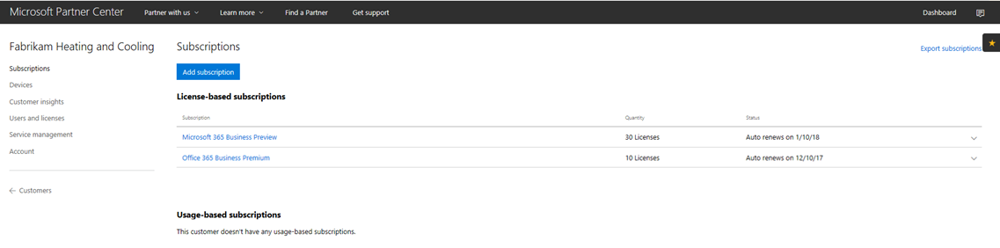
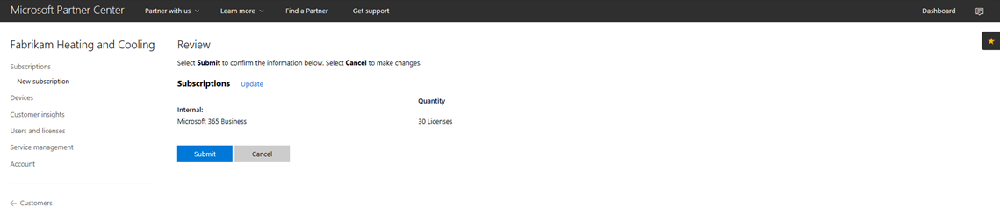
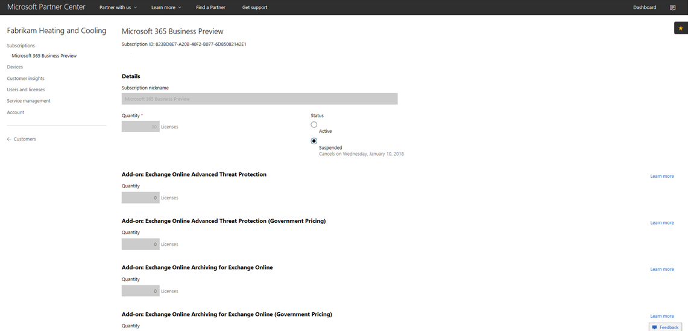
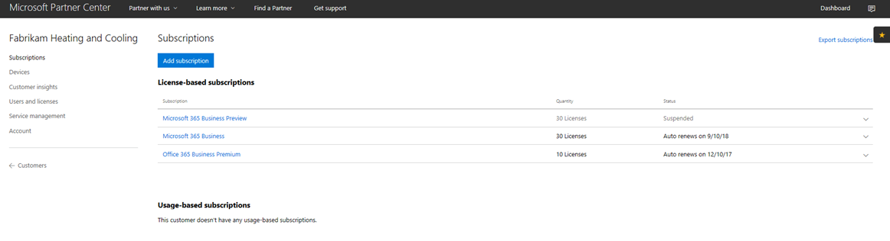
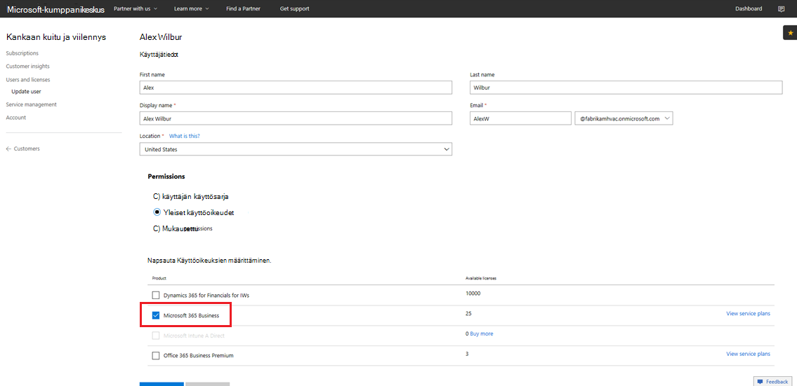

# Microsoft 365 Businessin CSP-tilauksen siirtyminenTransition a Microsoft 365 Business CSP subscription

Jos sinulla on Microsoft 365 Business Preview CSP -tilaus, selvitä tämän oppaan ohjeiden mukaan, miten voit siirtää aiemmin luodun esikatselutilauksen Microsoft 365 Business GA:ksi (yleinen saatavuus).If you have a Microsoft 365 Business Preview CSP subscription, follow this guide to find out how you can transition your existing preview subscription to Microsoft 365 Business GA (general availability).

**Esikatselutilauksen siirtyminen ga-tilaukseen****How to transition a preview subscription to GA**

1. Kirjaudu <a href="https://partnercenter.microsoft.com" target="_blank">kumppanikeskukseen</a>.Sign in to <a href="https://partnercenter.microsoft.com" target="_blank">Partner Center</a>.
2. Valitse koontinäytössä **Asiakkaat**ja etsi ja valitse yrityksen nimi.From the dashboard, select **Customers**, and then find and select the company name.

    Yhtiön tilaukset listataan.The subscriptions for the company will be listed.

    
    
3. Valitse Yrityksen **Tilaukset-sivulla** Lisää **tilaus**.On the company's **Subscriptions** page, select **Add subscription**.
4. Valitse **Uusi tilaus -sivulla** **Pienyritys** ja valitse sitten luettelosta **Microsoft 365 Business.**On the **New subscription** page, select **Small business** and then select **Microsoft 365 Business** from the list.
5. Lisää käyttöoikeuksien määrä ja valitse sitten **Seuraava: Tarkista,** jos haluat tarkastella tilausta, ja valitse sitten **Lähetä**.Add the number of licenses and then select **Next: Review** to review the subscription and then select **Submit**.

    

    **Käyttöoikeuspohjaisissa tilauksissa** näkyvät **Microsoft 365 Business Preview** ja Microsoft **365 Business**.The **License-based subscriptions** will show **Microsoft 365 Business Preview** and **Microsoft 365 Business**. Keskeytät preview-tilauksen seuraavaksi.You'll suspend the Preview subscription next.

6. Valitse **Microsoft 365 Business Preview**.Select **Microsoft 365 Business Preview**.
7. Keskeytä Esikatselutilaus valitsemalla **Microsoft 365 Business Preview** -sivulla **Keskeytetty.**On the **Microsoft 365 Business Preview** page, select **Suspended** to suspend the Preview subscription.

    

8. Vahvista valitsemalla **Lähetä.**Select **Submit** to confirm.

    Varmista **Tilaukset-sivulla,** että **Microsoft 365 Business Preview -tila** näkyy **Keskeytettynä**.On the **Subscriptions** page, confirm that the **Microsoft 365 Business Preview** status shows **Suspended**.

    

9. Vaihtoehtoisesti voit myös vahvistaa käyttöoikeussopimuksen.Optionally, you can also validate the license agreement. Voit tehdä tämän seuraavasti:To do this, follow these steps:
    1. Valitse Yrityksen **Tilaukset-sivulta** **Käyttäjät ja käyttöoikeudet.**Select **Users and licenses** from the company's **Subscriptions** page.
    2. Valitse **käyttäjä Käyttäjät ja käyttöoikeudet** -sivulla.On the **Users and licenses** page, select a user.
    3. Tarkista käyttäjän sivulla **Käyttöoikeuksien määrittäminen** -osio ja varmista, että siinä näkyy **Microsoft 365 Business**.On the user's page, check the **Assign licenses** section and confirm that it shows **Microsoft 365 Business**.

        

## Vaikutus asiakkaisiin ja käyttäjiin siirtymisen aikana ja sen jälkeenImpact to customers and users during and after transition

Ei ole vaikutusta asiakkaisiin ja käyttäjiin siirtymisen ja post transition.There's no impact to customers and users during transition and post transition.

## Vaikutus asiakkaisiin, jotka eivät siirryImpact to customers who don't transition

Seuraavassa taulukossa on yhteenveto vaikutuksesta asiakkaisiin, jotka eivät siirry Microsoft 365 Business Preview -tilauksesta Microsoft 365 Business -tilaukseen.The following table summarizes the impact to customers who don't transition from a Microsoft 365 Business Preview subscription to a Microsoft 365 Business subscription.

|       | T-0–T+30T-0 to T+30     | T+30–T+60T+30 to T+60 | T+60–T+120T+60 to T+120 | Yli T+120Beyond T+120  |
|-------|-----------------|--------------|---------------|---------------|
| **Valtion****State** | LisäaikanaIn grace period | VanhentunutExpired      | Poistettu käytöstäDisabled      | DeprovisionedDeprovisioned |
| **Palvelun vaikutukset****Service impacts**                                                        |
| **Microsoft 365 Business -hallintaportaali****Microsoft 365 Business admin portal** | Ei vaikutusta toiminnallisuuteenNo impact to functionality | Ei vaikutusta toiminnallisuuteenNo impact to functionality | Voi lisätä / poistaa käyttäjiä, ostaa tilauksia.Can add/delete users, purchase subscriptions.  Käyttöoikeuksia ei voi määrittää tai peruuttaa.Can't assign/revoke licenses. | Asiakkaan tilaus ja kaikki tiedot poistetaan.Customer's subscription and all data is deleted. Järjestelmänvalvoja voi hallita muita maksullisia tilauksia.Admin can manage other paid subscriptions. |
| **Office-sovellukset****Office apps**                         | Ei loppukäyttäjän vaikutustaNo end user impact | Ei loppukäyttäjän vaikutustaNo end user impact | Office siirtyy rajoitetun toiminnan tilaan.Office enters reduced functionality mode.  Käyttäjät voivat tarkastella vain tiedostoja.Users can view files only. | Office siirtyy rajoitetun toiminnan tilaan.Office enters reduced functionality mode.  Käyttäjät voivat tarkastella vain tiedostoja.Users can view files only. |
| **Pilvipalvelut (SharePoint Online, Exchange Online, Skype, Teams ja paljon muuta)****Cloud services (SharePoint Online, Exchange Online, Skype, Teams, and more)** | Ei loppukäyttäjän vaikutustaNo end user impact | Ei loppukäyttäjän vaikutustaNo end user impact | Loppukäyttäjillä ja järjestelmänvalvojilla ei ole pääsyä pilven tietoihin.End users and admins have no access to data in the cloud. | Asiakkaan tilaus ja kaikki tiedot poistetaan.Customer's subscription and all data are deleted. |
| **EM+S-komponentit****EM+S components** | Ei järjestelmänvalvojan vaikutustaNo admin impact  Ei loppukäyttäjän vaikutustaNo end user impact | Ei järjestelmänvalvojan vaikutustaNo admin impact  Ei loppukäyttäjän vaikutustaNo end user impact | Ominaisuutta ei enää panna täytäntöön.Capability is no longer enforced.  Lisätietoja on [ohjeaiheessa Mobiililaitteen vaikutukset tilauksen vanhenemisen yhteydessä](#mobile-device-impacts-upon-subscription-expiration) ja [Windows 10 PC:n vaikutukset tilauksen vanhenemisen yhteydessä.](#windows-10-pc-impacts-upon-subscription-expiration)See [Mobile device impacts upon subscription expiration](#mobile-device-impacts-upon-subscription-expiration) and [Windows 10 PC impacts upon subscription expiration](#windows-10-pc-impacts-upon-subscription-expiration) for more info. | Ominaisuutta ei enää panna täytäntöön.Capability is no longer enforced.  Lisätietoja on [ohjeaiheessa Mobiililaitteen vaikutukset tilauksen vanhenemisen yhteydessä](#mobile-device-impacts-upon-subscription-expiration) ja [Windows 10 PC:n vaikutukset tilauksen vanhenemisen yhteydessä.](#windows-10-pc-impacts-upon-subscription-expiration)See [Mobile device impacts upon subscription expiration](#mobile-device-impacts-upon-subscription-expiration) and [Windows 10 PC impacts upon subscription expiration](#windows-10-pc-impacts-upon-subscription-expiration) for more info. |
| **Windows 10 -liiketoiminta****Windows 10 Business** | Ei järjestelmänvalvojan vaikutustaNo admin impact  Ei loppukäyttäjän vaikutustaNo end user impact | Ei järjestelmänvalvojan vaikutustaNo admin impact  Ei loppukäyttäjän vaikutustaNo end user impact | Ominaisuutta ei enää panna täytäntöön.Capability is no longer enforced.  Lisätietoja on [ohjeaiheessa Mobiililaitteen vaikutukset tilauksen vanhenemisen yhteydessä](#mobile-device-impacts-upon-subscription-expiration) ja [Windows 10 PC:n vaikutukset tilauksen vanhenemisen yhteydessä.](#windows-10-pc-impacts-upon-subscription-expiration)See [Mobile device impacts upon subscription expiration](#mobile-device-impacts-upon-subscription-expiration) and [Windows 10 PC impacts upon subscription expiration](#windows-10-pc-impacts-upon-subscription-expiration) for more info. | Ominaisuutta ei enää panna täytäntöön.Capability is no longer enforced.  Lisätietoja on [ohjeaiheessa Mobiililaitteen vaikutukset tilauksen vanhenemisen yhteydessä](#mobile-device-impacts-upon-subscription-expiration) ja [Windows 10 PC:n vaikutukset tilauksen vanhenemisen yhteydessä.](#windows-10-pc-impacts-upon-subscription-expiration)See [Mobile device impacts upon subscription expiration](#mobile-device-impacts-upon-subscription-expiration) and [Windows 10 PC impacts upon subscription expiration](#windows-10-pc-impacts-upon-subscription-expiration) for more info. |
| **Azure AD -kirjautuminen Windows 10 -tietokoneeseen****Azure AD login to a Windows 10 PC** | Ei järjestelmänvalvojan vaikutustaNo admin impact  Ei loppukäyttäjän vaikutustaNo end user impact | Ei järjestelmänvalvojan vaikutustaNo admin impact  Ei loppukäyttäjän vaikutustaNo end user impact | Ei järjestelmänvalvojan vaikutustaNo admin impact  Ei loppukäyttäjän vaikutustaNo end user impact | Kun vuokraajan on poistettu, käyttäjä voi kirjautua sisään vain paikallisilla tunnistetiedoilla.Once the tenant is deleted, a user can sign in with local credentials only. Kuvaa laite uudelleen, jos paikallisia tunnistetietoja ei ole.Re-image the device if there are no local credentials. |

## Mobiililaitteen vaikutukset tilauksen päättymisen jälkeenMobile device impacts upon subscription expiration

Seuraavassa taulukossa on yhteenveto mobiililaitteiden sovellusten hallintakäytäntöjen vaikutuksesta.The following table summarizes the impact to the app management policies on mobile devices.

|                            | Täysin lisensoitu kokemusFully licensed experience                      | T+60 päivää päättymisen jälkeenT+60 days post expiration          |
|----------------------------|------------------------------------------------|------------------------------------|
| **Työtiedostojen poistaminen passiivisesta laitteesta****Delete work files from an inactive device** | Työtiedostot poistetaan valittujen päivien jälkeenWork files are removed after selected days | Työtiedostot säilyvät käyttäjän henkilökohtaisissa laitteissaWork files remain on the user's personal devices |
| **Pakota käyttäjät tallentamaan kaikki työtiedostot OneDrive for Businessiin****Force users to save all work files to OneDrive for Business** | Työtiedostot voidaan tallentaa vain OneDrive for BusinessiinWork files can only be saved to OneDrive for Business | Työtiedostoja voidaan tallentaa mihin tahansaWork files can be saved anywhere |
| **Salaa työtiedostot****Encrypt work files** | Työtiedostot salataanWork files are encrypted | Työtiedostoja ei enää salata.Work files are no longer encrypted.  Suojauskäytännöt poistetaan ja sovellusten Office-tiedot poistetaan.Security policies are removed and Office data on apps is removed. |
| **Vaadi PIN-koodi tai sormenjälki, jotta voit käyttää Office-sovelluksia****Require PIN or fingerprint to access Office apps** | Sovellusten rajoitettu käyttöRestricted access to apps | Ei sovellustason käyttörajoitustaNo app-level access restriction |
| **Nollaa PIN-koodi, kun kirjautuminen epäonnistuu****Reset PIN when login fails** | Sovellusten rajoitettu käyttöRestricted access to apps | Ei sovellustason käyttörajoitustaNo app-level access restriction |
| **Käyttäjien vaatiminen kirjautumaan uudelleen office-sovellusten käyttämättömänä jälkeen****Require users to sign in again after Office apps have been idle** | Sisäänkirjautuminen vaaditaanSign-in required | Sisäänkirjautumista ei tarvitaNo sign-in required |
| **Estä työtiedostojen käyttö laitteissa, joiden suojaukset on murrettu****Deny access to work files on jailbroken or rooted devices** | Työtiedostoja ei voi käyttää jailbroken/juurtuneilla laitteillaWork files can't be accessed on jailbroken/rooted devices | Työtiedostoja voi käyttää jailbroken / juurtuneet laitteetWork files can be accessed on jailbroken/rooted devices |
| **Salli käyttäjien kopioida sisältöä Office-sovelluksista henkilökohtaisiin sovelluksiin****Allow users to copy content from Office apps to Personal apps** | Kopioiminen/liittäminen rajoitettu Microsoft 365 Business -tilauksen osana käytettävissä oleviin sovelluksiinCopy/paste restricted to apps available as part of Microsoft 365 Business subscription | Kopioi/liitä kaikkien sovellusten käytettävissäCopy/paste available to all apps |

## Windows 10 PC:n vaikutus tilauksen vanhenemisen yhteydessäWindows 10 PC impacts upon subscription expiration

Seuraavassa taulukossa on yhteenveto Windows 10 -laitteen määrityskäytäntöjen vaikutuksesta.The following table summarizes the impact to the Windows 10 device configuration policies.

|                            | Täysin lisensoitu kokemusFully licensed experience                      | T+60 päivää päättymisen jälkeenT+60 days post expiration          |
|----------------------------|------------------------------------------------|------------------------------------|
| **Tietokoneiden suojaaminen uhilta Windows Defenderin avulla****Help protect PCs from threats using Windows Defender** | Ottaminen käyttöön ja poistaminen käytöstä ei kuulu käyttäjän hallintaanTurn on/off is outside of user control | Käyttäjä voi ottaa Windows Defenderin käyttöön tai poistaa sen käytöstä Windows 10 -tietokoneessaUser can turn on/off Windows Defender on the Windows 10 PC |
| **Auta suojaamaan tietokoneitasi verkkopohjaisilta uhkilta Microsoft Edgessä****Help protect PCs from web-based threats in Microsoft Edge** | Tietokoneen suojaus Microsoft EdgessäPC protection in Microsoft Edge | Käyttäjä kanisteri hapantua model after/ lähettää PC suojelus kotona Mikroskooppi HioaUser can turn on/off PC protection in Microsoft Edge |
| **Laitteen näytön poistaminen käytöstä käyttämättömänä****Turn off device screen when idle** | Järjestelmänvalvoja määrittää näytön aikakatkaisun aikakatkaisukäytännönAdmin defines screen timeout interval policy | Loppukäyttäjä voi määrittää näytön aikakatkaisunScreen timeout can be configured by end user |
| **Salli käyttäjille sovellusten lataaminen Microsoft Storesta****Allow users to download apps from Microsoft Store** | Järjestelmänvalvoja määrittää, voiko käyttäjä ladata sovelluksia Microsoft StorestaAdmin defines if a user can download apps from Microsoft Store | Käyttäjä voi ladata sovelluksia Microsoft Storesta milloin tahansaUser can download apps from Microsoft Store anytime |
| **Salli käyttäjien käyttää Cortanaa****Allow users to access Cortana** | Järjestelmänvalvoja määrittää Cortanan käyttöoikeuksia koskevan käytännönAdmin defines policy on user access to Cortana | Cortanan käyttöön ottaminen ja poistaminen käytöstä käyttäjälaitteetUser devices to turn on/off Cortana |
| **Salli käyttäjien saada vinkkejä ja mainoksia Microsoftilta****Allow users to receive tips and advertisements from Microsoft** | Järjestelmänvalvoja määrittää käytännön, joka koskevat käyttäjien vastaanottovinkkejä ja mainoksia MicrosoftiltaAdmin defines policy on user receive tips and advertisements from Microsoft | Käyttäjä kanisteri hapantua model after/ lähettää tips ja ilmoitus polveutua MikroskooppiUser can turn on/off tips and advertisements from Microsoft |
| **Salli käyttäjille sisällön kopiointi Office-sovelluksista henkilökohtaisiin sovelluksiin****Allow users to copy content from Office apps into personal apps** | Järjestelmänvalvoja määrittää käytännön, joka pitää Windows 10 -laitteet ajan tasallaAdmin defines policy to keep Windows 10 devices up to date | Käyttäjät voivat päättää, milloin Windows päivitetäänUsers can decide when to update Windows |
