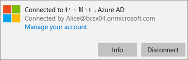
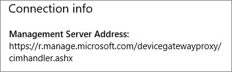
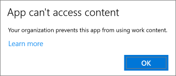
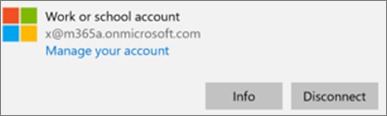
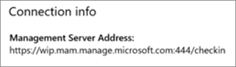

# Sovellusten suojausasetusten vahvistaminen Windows 10 -tietokoneissaValidate app protection settings on Windows 10 PCs

## Sen tarkistaminen, että käyttäjät eivät voi kopioida yritystietoja yrityksen laitteiden henkilökohtaisiin tiedostoihinVerify that users cannot copy company data to personal files on corporate devices

Kun olet [määrittänyt sovellusten suojauskäytännöt](protection-settings-for-windows-10-devices.md), saattaa kestää muutama tunti, ennen kuin käytäntöä sovelletaan käyttäjien laitteissa.After you [set up app protection policies](protection-settings-for-windows-10-devices.md), it may take up to a few hours for the policy to take effect on users' devices. Jos olet **ottanut Estä** käyttäjiä kopioimasta yritystietoja henkilökohtaisiin tiedostoihin ja pakotit heidät tallentamaan työtiedostot Yrityksen omistamien laitteiden **OneDrive for Business** -asetukseen, voit tarkistaa tämän käyttäjän laitteessa, kun käyttäjä on muodostanut yhteyden Azure AD:hen ja kirjautunut sisään.If you turned **On** the **Prevent users from copying company data to personal files and force them to save work files to OneDrive for Business** setting for company owned devices, you can check this on the user's device after they've connected to Azure AD and signed in. 
  
 **Yhteysasetusten tarkistaminen****Verify connection settings**
  
1. Kun olet kirjautunut Sisään Microsoft 365 Business Premium -tunnistetiedoilla ja muodostanut yhteyden Azure AD:seen [artikkelissa Windows-laitteiden määrittäminen Microsoft 365 Business Premium](set-up-windows-devices.md)-käyttäjille kuvatulla tavalla, siirry **Windows-asetusten** tileihin, jotka ovat käytössä töissä \>  \> **tai oppilaitoksessa.**After you sign in with Microsoft 365 Business Premium credentials and connect to Azure AD as described in [Set up Windows devices for Microsoft 365 Business Premium users](set-up-windows-devices.md), go to **Windows Settings** \> **Accounts** \> **Access work or school**. Valitse **Yhdistetty \<tenant name\> Azure AD:en** ja valitse **sitten Tiedot.**Choose **Connected to \<tenant name\> Azure AD**, and then choose **Info**.
    
    
  
2. **Hallittu-sivulla** näet hallintapalvelimen osoitteen sisältävät yhteystiedot seuraavassa kuvassa \<tenant name\>  esitetyllä tavalla. On the **Managed by** \<tenant name\> page, you can see the **Connection info** that includes a **Management Server Address** like the one shown in the following figure. 
    
    
  
 **Varmista, että yritystietoja ei voi liittää ei-hallittavaan sovellukseen****Verify that you cannot paste company data in a non-managed app**
  
1. Avaa Microsoft 365 Business Premiumin asentama Outlook 2016.Open Outlook 2016 that was installed by Microsoft 365 Business Premium.
    
2. Avaa sähköpostiviesti ja kopioi siitä jotakin sisältöä.Open an email and copy some content from it.
    
    Avaa Muistio ja yritä sitten liittää sisältö siihen.Open Notepad and attempt to paste the content in.
    
    Näyttöön tulee virheilmoitus, jossa todetaan, että sovellus ei voi käyttää sisältöä.You'll receive an error that states the app can't access content.
    
    
  
    Voit kuitenkin liittää saman sisällön Word 2016:een.You can, however, paste the same content into Word 2016.
    
## Sen tarkistaminen, että käyttäjät eivät voi kopioida yritystietoja henkilökohtaisten laitteiden henkilökohtaisiin tiedostoihinVerify that users cannot copy company data to personal files on personal devices

 **Yhteysasetusten tarkistaminen****Verify connection settings**
  
1. Siirry henkilökohtaisessa Windows 10 -laitteessasi, jossa olet kirjautunut sisään paikallisena käyttäjänä, **Windows-asetukset** ja valitse **sitten Tilien** käyttö töissä \> **tai oppilaitoksessa.**On your Windows 10 personal device where you're logged in as a local user, go to **Windows Settings**, and click or tap **Accounts** \> **Access work or school**.
    
2. Valitse **Käytä työpaikan tai oppilaitoksen tiliä** -kohdasta **Yhdistä**.Under the **Access work or school**, choose **Connect**.
    
3. Anna Microsoft 365 Business Premium -tunnistetietosi Määritä työ- tai koulutili **-valintaikkunaan** \> **Kirjaudu sisään.**Enter your Microsoft 365 Business Premium credential into the **Set up a work or school account dialog** \> **Sign in**.
    
4. Valitse **Käytä työpaikan tai oppilaitoksen tiliä** -sivulla **Työpaikan tai oppilaitoksen tili** ja valitse sitten **Tiedot**.On the **Access work or school** page, choose the **Work or school account**, and then choose **Info**.
    
    
  
5. Accessin **työ-** tai koulusivulla  näet yhteystiedot, jotka sisältävät **hallintapalvelimen** osoitteen, kuten seuraavassa kuvassa, ja sisältää sanat *wip* and *mam* within.On the **Access work or school** page, you can see the **Connection info** that includes a **Management Server Address** like the one shown in the following figure, and includes the words  *wip*  and  *mam*  within. 
    
    
  
 **Varmista, että yritystietoja ei voi liittää ei-hallittavaan sovellukseen****Verify that you cannot paste company data in a non-managed app**
  
1. Avaa Outlook 2016, lisää Tarvittaessa Microsoft 365 Business Premium -tili ja kirjaudu sisään Microsoft 365 Business Premium -tunnistetiedoillasi.Open Outlook 2016 and add your Microsoft 365 Business Premium account if necessary and sign in with your Microsoft 365 Business Premium credentials.
    
2. Avaa sähköpostiviesti ja kopioi siitä jotakin sisältöä.Open an email and copy some content from it.
    
    Avaa Muistio ja yritä sitten liittää sisältö siihen.Open Notepad and attempt to paste the content in.
    
    Näyttöön tulee virhesanoma, jonka mukaan Sovellus ei voi käyttää sisältöä.You'll receive an error that states App can't access content.
    
    
  
    Voit kuitenkin liittää saman sisällön Word 2016:een.You can, however, paste the same content into Word 2016.
    

