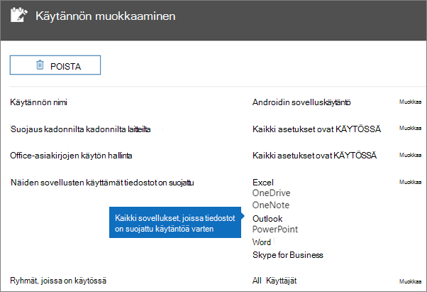
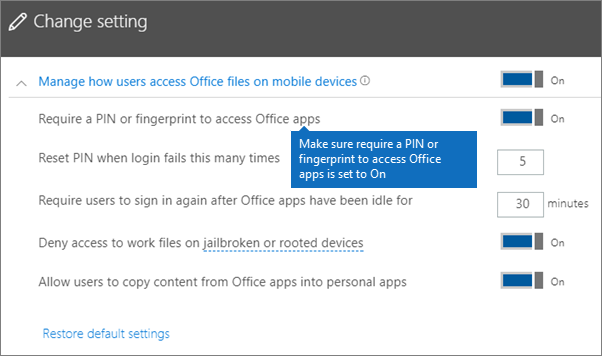
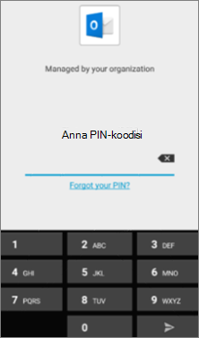
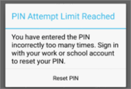
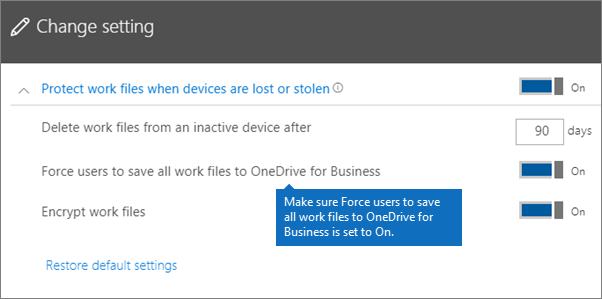
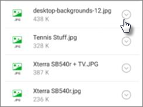
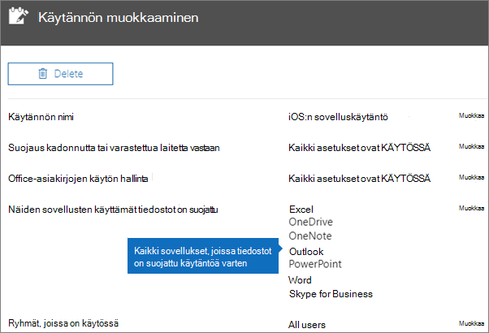
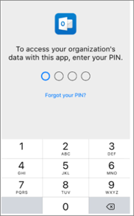

# Sovelluksen suojausasetusten vahvistaminen Android- tai iOS-laitteissa

Vahvista sovellusten suojausasetukset Android- tai iOS-laitteissa noudattamalla seuraavien osioiden ohjeita.
  
## Android
  
### Tarkista, että sovelluksen suojausasetukset toimivat käyttäjän laitteissa

Kun olet [määrittänyt Android-laitteiden sovellusasetukset](app-protection-settings-for-android-and-ios.md) sovellusten suojaamista varten, seuraavien ohjeiden avulla voit vahvistaa, että valitsemasi asetukset toimivat. 
  
Varmista ensin, että käytäntö koskee sovellusta, jossa aiot vahvistaa sen.
  
1. Valitse Microsoft 365 Business Premium [-hallintakeskuksessa](https://portal.office.com) **Käytäntöjen** \> **muokkauskäytäntö**.
    
2. Valitse **Androidin sovelluskäytäntö** asetuksissa luomillesi asetuksille tai toiselle luomallesi käytännölle ja varmista, että se on otettu käyttöön esimerkiksi Outlookissa. 
    
    
  
### Vahvista, että Office-sovellusten käyttäminen edellyttää PIN-koodia tai sormenjälkeä

Valitse **Muokkaa käytäntöä** -ruudussa **Muokkaa** **Office-tiedostojen käytön hallinta** -kohdan vieressä, laajenna **Käyttäjien Office-tiedostojen käytön hallinta mobiililaitteissa** ja varmista, että **Office-sovellusten käyttäminen edellyttää PIN-koodia tai sormenjälkeä** on **käytössä**.
  

  
1. Avaa Outlook käyttäjän Android-laitteessa ja kirjaudu sisään käyttäjän Microsoft 365 Business Premium -tunnistetiedoilla.
    
2. Sinua pyydetään myös antamaan PIN-koodi tai käyttämään sormenjälkiä.
    
    
  
### Vahvista Palauta PIN-koodi, kun on tehty tämä määrä epäonnistuneita yrityksiä

Valitse **Muokkaa käytäntöä** -ruudussa **Office-tiedostojen käytönvalvonnan**vieressä **Muokkaa,** laajenna **Hallitse, miten käyttäjät voivat käyttää Office-tiedostoja mobiililaitteissa,** ja varmista, että **Palauta PIN-koodi epäonnistuneiden yritysten määrän jälkeen** on määritetty numero. Tämä on oletusarvoisesti 5. 
  
1. Avaa Outlook käyttäjän Android-laitteessa ja kirjaudu sisään käyttäjän Microsoft 365 Business Premium -tunnistetiedoilla.
    
2. Kirjoita virheellinen PIN-koodi niin monta kertaa kuin käytäntö määrittää. Näyttöön tulee kehote, jonka mukaan **PIN-koodin** nollaaminen on saavutettu PIN-koodilla. 
    
    
  
3. Paina **Palauta PIN-koodi**. Sinua pyydetään kirjautumaan sisään käyttäjän Microsoft 365 Business Premium -tunnistetiedoilla ja asettamaan sitten uusi PIN-tunnus.
    
### Vahvista Pakota käyttäjät tallentamaan kaikki työtiedostot OneDrive for Businessiin

Valitse **Muokkaa käytäntöä** -ruudussa **Muokkaa** **Kadonneiden tai varastettujen laitteiden suojaus** -kohdan vieressä, laajenna **Työtiedostojen suojaaminen laitteiden katoamisen tai varastamisen varalta** ja varmista, että **Pakota käyttäjät tallentamaan kaikki työtiedostot OneDrive for Businessiin** on **käytössä**.
  

  
1. Avaa Käyttäjän Android-laitteessa Outlook ja kirjaudu sisään käyttäjän Microsoft 365 Business Premium -tunnistetiedoilla ja anna pin-koodi pyydettäessä.
    
2. Avaa sähköpostiviesti, jossa on liite, ja valitse liitteen tietojen vieressä oleva alanuolikuva.
    
    
  
    Näytön alareunassa näkyy **ei voi tallentaa laitteeseen.** 
    
    
  
    > [!NOTE]
    > Tallentaminen OneDrive for Businessiin ei ole käytössä Androidissa tällä hetkellä, joten näet vain, että tallentaminen paikallisesti on estetty. 
  
### Vahvista Vaadi käyttäjää kirjautumaan uudelleen, jos Office-sovellukset ovat olleet käyttämättöminä määritetyn ajan

Valitse **Muokkaa käytäntöä** -ruudussa **Office-tiedostojen käytönvalvonnan**vieressä **Muokkaa,** laajenna **Hallitse, miten käyttäjät käyttävät Office-tiedostoja mobiililaitteissa,** ja varmista, että **Vaadi käyttäjiä kirjautumaan uudelleen sisään, kun Office-sovellukset ovat olleet käyttämättömänä,** on määritetty muutama ksi minuutiksi. Tämä on oletusarvoisesti 30 minuuttia. 
  
1. Avaa Käyttäjän Android-laitteessa Outlook ja kirjaudu sisään käyttäjän Microsoft 365 Business Premium -tunnistetiedoilla ja anna pin-koodi pyydettäessä.
    
2. Outlookin Saapuneet-kansion pitäisi nyt näkyä. Älä koske Android-laitteeseen vähintään 30 minuuttiin (tai muun käytäntöön määrittämääsi aikaa pidemmän ajan). Todennäköisesti laitteen näyttö himmenee.
    
3. Käytä Outlookia uudelleen Android-laitteella.
    
4. Sinua pyydetään antamaan PIN-koodi, ennen kuin voit käyttää Outlookia uudelleen.
    
### Vahvista Suojaa työtiedostot salauksella

Valitse **Muokkaa käytäntöä** -ruudussa **Muokkaa** **Kadonneiden tai varastettujen laitteiden suojaus** -kohdan vieressä, laajenna **Työtiedostojen suojaaminen laitteiden katoamisen tai varastamisen varalta** ja varmista, että **Suojaa työtiedostot salauksella** on **käytössä** ja **Pakota käyttäjät tallentamaan kaikki työtiedostot OneDrive for Businessiin** **pois käytöstä**.
  
1. Avaa Käyttäjän Android-laitteessa Outlook ja kirjaudu sisään käyttäjän Microsoft 365 Business Premium -tunnistetiedoilla ja anna pin-koodi pyydettäessä.
    
2. Avaa sähköpostiviesti, joka sisältää muutamia kuvatiedostoliitteitä.
    
3. Voit tallentaa liitteen valitsemalla sen tietojen vieressä olevan alanuolikuvakkeen.
    
    
  
4. Näyttöön voi tulla pyyntö sallia Outlookin käyttää laitteessa olevia valokuvia, mediatiedostoja ja muita tiedostoja. Valitse **Salli**.
    
5. Valitse **Tallenna laitteeseen** näytön alareunassa ja avaa sitten **Galleria** -sovellus. 
    
6. Luettelossa pitäisi näkyä salattu valokuva (tai useita, jos tallensit useita kuvatiedostoliitteitä). Se voi näkyä Kuvat-luettelossa harmaana ruutuna, jonka keskellä on valkoisen ympyrän sisällä oleva valkoinen huutomerkki.
    
    
  
## Ios
  
### Sovellusten suojausasetusten toiminnan varmistaminen käyttäjien laitteissa

Kun olet [määrittänyt iOS-laitteiden sovellusasetukset](app-protection-settings-for-android-and-ios.md) sovellusten suojaamista varten, seuraavien ohjeiden avulla voit vahvistaa, että valitsemasi asetukset toimivat. 
  
Varmista ensin, että käytäntö koskee sovellusta, jossa aiot vahvistaa sen.
  
1. Valitse Microsoft 365 Business Premium [-hallintakeskuksessa](https://portal.office.com) **Käytäntöjen** \> **muokkauskäytäntö**.
    
2. Valitse **iOS:n sovelluskäytäntö** asennuksen yhteydessä luoduille asetuksille tai toiselle luomallesi käytännölle ja varmista, että se on otettu käyttöön esimerkiksi Outlookissa. 
    
    
  
### Vahvista Office-sovellusten käyttäminen edellyttää PIN-koodia

Valitse **Muokkaa käytäntöä** -ruudussa **Muokkaa** **Office-tiedostojen käytön hallinta** -kohdan vieressä, laajenna **Käyttäjien Office-tiedostojen käytön hallinta mobiililaitteissa** ja varmista, että **Office-sovellusten käyttäminen edellyttää PIN-koodia tai sormenjälkeä** on **käytössä**.
  

  
1. Avaa Käyttäjän iOS-laitteessa Outlook ja kirjaudu sisään käyttäjän Microsoft 365 Business Premium -tunnistetiedoilla.
    
2. Sinua pyydetään myös antamaan PIN-koodi tai käyttämään sormenjälkiä.
    
    
  
### Vahvista Palauta PIN-koodi, kun on tehty tämä määrä epäonnistuneita yrityksiä

Valitse **Muokkaa käytäntöä** -ruudussa **Office-tiedostojen käytönvalvonnan**vieressä **Muokkaa,** laajenna **Hallitse, miten käyttäjät voivat käyttää Office-tiedostoja mobiililaitteissa,** ja varmista, että **Palauta PIN-koodi epäonnistuneiden yritysten määrän jälkeen** on määritetty numero. Tämä on oletusarvoisesti 5. 
  
1. Avaa Käyttäjän iOS-laitteessa Outlook ja kirjaudu sisään käyttäjän Microsoft 365 Business Premium -tunnistetiedoilla.
    
2. Kirjoita virheellinen PIN-koodi niin monta kertaa kuin käytäntö määrittää. Näyttöön tulee kehote, jonka mukaan **PIN-koodin** nollaaminen on saavutettu PIN-koodilla. 
    
    
  
3. Paina **OK**. Sinua pyydetään kirjautumaan sisään käyttäjän Microsoft 365 Business Premium -tunnistetiedoilla ja asettamaan sitten uusi PIN-tunnus.
    
### Vahvista Pakota käyttäjät tallentamaan kaikki työtiedostot OneDrive for Businessiin

Valitse **Muokkaa käytäntöä** -ruudussa **Muokkaa** **Kadonneiden tai varastettujen laitteiden suojaus** -kohdan vieressä, laajenna **Työtiedostojen suojaaminen laitteiden katoamisen tai varastamisen varalta** ja varmista, että **Pakota käyttäjät tallentamaan kaikki työtiedostot OneDrive for Businessiin** on **käytössä**.
  

  
1. Avaa käyttäjän iOS-laitteessa Outlook ja kirjaudu sisään käyttäjän Microsoft 365 Business Premium -tunnistetiedoilla ja anna pin-koodi pyydettäessä.
    
2. Avaa liitteen sisältävä sähköpostiviesti, avaa liite ja valitse **Tallenna** näytön alareunassa. 
    
    
  
3. Näkyvissä pitäisi olla vaihtoehto vain OneDrive for Businessille. Jos näin ei ole, napauta **Lisää tili** ja valitse **Lisää tallennustilatili -näytöstä** **OneDrive for Business.** Anna käyttäjän Microsoft 365 Business Premium -käyttöjärjestelmän avulla sisäänkirjautumista varten pyydettäessä. 
    
    Napauta **Tallenna** ja valitse **OneDrive for Business**.
    
### Vahvista Vaadi käyttäjää kirjautumaan uudelleen, jos Office-sovellukset ovat olleet käyttämättöminä määritetyn ajan

Valitse **Muokkaa käytäntöä** -ruudussa **Office-tiedostojen käytönvalvonnan**vieressä **Muokkaa,** laajenna **Hallitse, miten käyttäjät käyttävät Office-tiedostoja mobiililaitteissa,** ja varmista, että **Vaadi käyttäjiä kirjautumaan uudelleen sisään, kun Office-sovellukset ovat olleet käyttämättömänä,** on määritetty muutama ksi minuutiksi. Tämä on oletusarvoisesti 30 minuuttia. 
  
1. Avaa käyttäjän iOS-laitteessa Outlook ja kirjaudu sisään käyttäjän Microsoft 365 Business Premium -tunnistetiedoilla ja anna pin-koodi pyydettäessä.
    
2. Outlookin Saapuneet-kansion pitäisi nyt näkyä. Älä koske iOS-laitteeseen vähintään 30 minuuttiin (tai muun käytäntöön määrittämääsi aikaa pidemmän ajan). Todennäköisesti laitteen näyttö himmenee.
    
3. Käytä Outlookia uudelleen iOS-laitteessa.
    
4. Sinua pyydetään antamaan PIN-koodi, ennen kuin voit käyttää Outlookia uudelleen.
    
### Vahvista Suojaa työtiedostot salauksella

Valitse **Muokkaa käytäntöä** -ruudussa **Muokkaa** **Kadonneiden tai varastettujen laitteiden suojaus** -kohdan vieressä, laajenna **Työtiedostojen suojaaminen laitteiden katoamisen tai varastamisen varalta** ja varmista, että **Suojaa työtiedostot salauksella** on **käytössä** ja **Pakota käyttäjät tallentamaan kaikki työtiedostot OneDrive for Businessiin** **pois käytöstä**.
  
1. Avaa käyttäjän iOS-laitteessa Outlook ja kirjaudu sisään käyttäjän Microsoft 365 Business Premium -tunnistetiedoilla ja anna pin-koodi pyydettäessä.
    
2. Avaa sähköpostiviesti, joka sisältää muutamia kuvatiedostoliitteitä.
    
3. Napauta liitettä ja **Tallenna**-vaihtoehtoa sen alla. 
    
4. Avaa **Valokuvat**-sovellus aloitusnäytössä. Näkyviin tulee tallennettu mutta salattu valokuva (tai useampia, jos tallensit useita kuvatiedostoliitteitä). 
    
---

