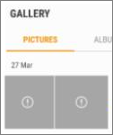
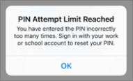

# Sovellusten suojausasetusten vahvistaminen Android- tai iOS-laitteissaValidate app protection settings on Android or iOS devices

Vahvista sovellusten suojausasetukset Android- tai iOS-laitteissa seuraavien osioiden ohjeiden mukaisesti.Follow the instructions in the following sections to validate app protection settings on Android or iOS devices.
  
## AndroidAndroid
  
### Tarkista, että sovellusten suojausasetukset toimivat käyttäjien laitteissaCheck that the app protection settings are working on user devices

Kun olet [määrittänyt Android-laitteiden sovellusasetukset](app-protection-settings-for-android-and-ios.md) sovellusten suojaamista varten, seuraavien ohjeiden avulla voit vahvistaa, että valitsemasi asetukset toimivat.After you [set app configurations for Android devices](app-protection-settings-for-android-and-ios.md) to protect the apps, you can follow these steps to validate that the settings you chose work. 
  
Varmista ensin, että käytäntö koskee sovellusta, jossa aiot vahvistaa sen.First, make sure that the policy applies to the app in which you're going to validate it.
  
1. Valitse Microsoft 365 Business Premium [-hallintakeskuksessa](https://portal.office.com) **Käytäntöjen** \> **muokkauskäytäntö.**In the Microsoft 365 Business Premium [admin center](https://portal.office.com), go to **Policies** \> **Edit policy**.
    
2. Valitse **Androidin sovelluskäytäntö** asetuksissa, jotka olet luonut määrityksen yhteydessä, tai jokin muu luomasi käytäntö, ja varmista, että se on esimerkiksi pakotettu Outlookissa.Choose **Application policy for Android** for the settings you created at setup, or another policy you created, and verify that it's enforced for Outlook, for example. 
    
    
  
### Vahvista, että Office-sovellusten käyttäminen edellyttää PIN-koodia tai sormenjälkeäValidate Require a PIN or a fingerprint to access Office apps

Valitse **Muokkaa käytäntöä** -ruudussa **Muokkaa** **Office-tiedostojen käytön hallinta** -kohdan vieressä, laajenna **Käyttäjien Office-tiedostojen käytön hallinta mobiililaitteissa** ja varmista, että **Office-sovellusten käyttäminen edellyttää PIN-koodia tai sormenjälkeä** on **käytössä**.In the **Edit policy** pane, choose **Edit** next to **Office documents access control**, expand **Manage how users access Office files on mobile devices**, and make sure that **Require a PIN or fingerprint to access Office apps** is set to **On**.
  

  
1. Avaa Outlook käyttäjän Android-laitteessa ja kirjaudu sisään käyttäjän Microsoft 365 Business Premium -tunnistetiedoilla.In the user's Android device, open Outlook and sign in with the user's Microsoft 365 Business Premium credentials.
    
2. Sinua pyydetään myös antamaan PIN-koodi tai käyttämään sormenjälkeä.You'll also be prompted to enter a PIN or use a fingerprint.
    
    
  
### Vahvista Palauta PIN-koodi, kun on tehty tämä määrä epäonnistuneita yrityksiäValidate Reset PIN after number of failed attempts

Valitse **Muokkaa** käytäntöä  -ruudussa **Muokkaa Office-tiedostojen** käytön hallinnan vieressä, laajenna Hallitse käyttäjien Office-tiedostojen käyttöä mobiililaitteissa ja varmista, että **PALAUTA PIN-koodi,** kun epäonnistuneita yrityksiä **on** määritetty joksikin määräksi.In the **Edit policy** pane, choose **Edit** next to **Office documents access control**, expand **Manage how users access Office files on mobile devices**, and make sure that **Reset PIN after number of failed attempts** is set to some number. Tämä on oletusarvoisesti 5.This is 5 by default. 
  
1. Avaa Outlook käyttäjän Android-laitteessa ja kirjaudu sisään käyttäjän Microsoft 365 Business Premium -tunnistetiedoilla.In the user's Android device, open Outlook and sign in with the user's Microsoft 365 Business Premium credentials.
    
2. Kirjoita virheellinen PIN-koodi niin monta kertaa kuin käytäntö määrittää.Enter an incorrect PIN as many times as specified by the policy. Näyttöön tulee kehote, jossa pyydetään, että **PIN-koodin palautusyritysrajoitus** on saavutettu.You'll see a prompt that states **PIN Attempt Limit Reached** to reset the PIN. 
    
    
  
3. Paina **Palauta PIN-koodi**.Press **Reset PIN**. Sinua pyydetään kirjautumaan sisään käyttäjän Microsoft 365 Business Premium -tunnistetiedoilla ja määrittämään uusi PIN-koodi.You'll be prompted to sign in with the user's Microsoft 365 Business Premium credentials, and then required to set a new PIN.
    
### Vahvista Pakota käyttäjät tallentamaan kaikki työtiedostot OneDrive for BusinessiinValidate Force users to save all work files to OneDrive for Business

Valitse **Muokkaa käytäntöä** -ruudussa **Muokkaa** **Kadonneiden tai varastettujen laitteiden suojaus** -kohdan vieressä, laajenna **Työtiedostojen suojaaminen laitteiden katoamisen tai varastamisen varalta** ja varmista, että **Pakota käyttäjät tallentamaan kaikki työtiedostot OneDrive for Businessiin** on **käytössä**.In the **Edit policy** pane, choose **Edit** next to **Protection against lost or stolen devices**, expand **Protect work files when devices are lost or stolen**, and make sure that **Force users to save all work files to OneDrive for Business** is set to **On**.
  

  
1. Avaa Outlook käyttäjän Android-laitteessa, kirjaudu sisään käyttäjän Microsoft 365 Business Premium -tunnistetiedoilla ja anna TARVITTAESSA PIN-koodi.In the user's Android device, open Outlook and sign in with the user's Microsoft 365 Business Premium credentials, and enter a PIN if requested.
    
2. Avaa sähköpostiviesti, jossa on liite, ja valitse liitteen tietojen vieressä oleva alanuolikuva.Open an email that contains an attachment and tap the down arrow icon next to the attachment's information.
    
    
  
    Näytön alareunassa **näkyy Ei voi tallentaa** laitteeseen -kohta.You'll see **Cannot save to device** on the bottom of the screen. 
    
    
  
    > [!NOTE]
    > Tallentaminen OneDrive for Businessiin ei ole käytössä Androidissa tällä hetkellä, joten näet vain, että tallentaminen paikallisesti on estetty.Saving to OneDrive for Business is not enabled for Android at this time, so you can only see that saving locally is blocked. 
  
### Vahvista Vaadi käyttäjää kirjautumaan uudelleen, jos Office-sovellukset ovat olleet käyttämättöminä määritetyn ajanValidate Require user to sign in again if Office apps have been idle for a specified time

Valitse **Muokkaa** käytäntöä  -ruudussa **Muokkaa Office-tiedostojen** käytön hallinta -kohdan vieressä, laajenna Hallitse käyttäjien **Office-tiedostojen** käyttöä mobiililaitteissa ja varmista, että Edellytä, että käyttäjät kirjautuvat uudelleen, kun **Office-sovellukset** ovat olleet käyttämättömänä, on määritetty joitakin minuutteja.In the **Edit policy** pane, choose **Edit** next to **Office documents access control**, expand **Manage how users access Office files on mobile devices**, and make sure that **Require users to sign in again after Office apps have been idle for** is set to some number of minutes. Tämä on oletusarvoisesti 30 minuuttia.This is 30 minutes by default. 
  
1. Avaa Outlook käyttäjän Android-laitteessa, kirjaudu sisään käyttäjän Microsoft 365 Business Premium -tunnistetiedoilla ja anna TARVITTAESSA PIN-koodi.In the user's Android device, open Outlook and sign in with the user's Microsoft 365 Business Premium credentials, and enter a PIN if requested.
    
2. Outlookin Saapuneet-kansion pitäisi nyt näkyä. Älä koske Android-laitteeseen vähintään 30 minuuttiin (tai muun käytäntöön määrittämääsi aikaa pidemmän ajan). Todennäköisesti laitteen näyttö himmenee.You should now see Outlook's inbox. Let the Android device idle untouched for at least 30 minutes (or some other amount of time, longer than what you specified in the policy). The device will likely dim.
    
3. Käytä Outlookia uudelleen Android-laitteessa.Access Outlook on the Android device again.
    
4. Sinua pyydetään antamaan PIN-koodi, ennen kuin voit käyttää Outlookia uudelleen.You'll be prompted to enter your PIN before you can access Outlook again.
    
### Vahvista Suojaa työtiedostot salauksellaValidate Protect work files with encryption

Valitse **Muokkaa käytäntöä** -ruudussa **Muokkaa** **Kadonneiden tai varastettujen laitteiden suojaus** -kohdan vieressä, laajenna **Työtiedostojen suojaaminen laitteiden katoamisen tai varastamisen varalta** ja varmista, että **Suojaa työtiedostot salauksella** on **käytössä** ja **Pakota käyttäjät tallentamaan kaikki työtiedostot OneDrive for Businessiin** **pois käytöstä**.In the **Edit policy** pane, choose **Edit** next to **Protection against lost or stolen devices**, expand **Protect work files when devices are lost or stolen**, and make sure that **Protect work files with encryption** is set to **On**, and **Force users to save all work files to OneDrive for Business** is set to **Off**.
  
1. Avaa Outlook käyttäjän Android-laitteessa, kirjaudu sisään käyttäjän Microsoft 365 Business Premium -tunnistetiedoilla ja anna TARVITTAESSA PIN-koodi.In the user's Android device, open Outlook and sign in with the user's Microsoft 365 Business Premium credentials, and enter a PIN if requested.
    
2. Avaa sähköpostiviesti, joka sisältää muutaman kuvatiedoston liitetiedoston.Open an email that contains a few image file attachments.
    
3. Voit tallentaa liitteen valitsemalla sen tietojen vieressä olevan alanuolikuvakkeen.Tap the down arrow icon next to the attachment's info to save it.
    
    
  
4. Näyttöön voi tulla pyyntö sallia Outlookin käyttää laitteessa olevia valokuvia, mediatiedostoja ja muita tiedostoja. Valitse **Salli**.You may be prompted to allow Outlook to access photos, media, and files on your device. Tap **Allow**.
    
5. Valitse **Tallenna laitteeseen** näytön alareunassa ja avaa sitten **Galleria** -sovellus.At the bottom of the screen, choose to **Save to Device** and then open the **Gallery** app. 
    
6. Luettelossa pitäisi näkyä salattu valokuva (tai useita, jos tallensit useita kuvatiedostoliitteitä). Se voi näkyä Kuvat-luettelossa harmaana ruutuna, jonka keskellä on valkoisen ympyrän sisällä oleva valkoinen huutomerkki.You should see an encrypted photo (or more, if you saved multiple image file attachments) in the list. It may appear in the Pictures list as a gray square with a white exclamation point within a white circle in the center of the gray square.
    
    
  
## iOSiOS
  
### Sovellusten suojausasetusten toiminnan varmistaminen käyttäjien laitteissaCheck that the App protection settings are working on user devices

Kun olet [määrittänyt iOS-laitteiden sovellusasetukset](app-protection-settings-for-android-and-ios.md) sovellusten suojaamista varten, seuraavien ohjeiden avulla voit vahvistaa, että valitsemasi asetukset toimivat.After you [set app configurations for iOS devices](app-protection-settings-for-android-and-ios.md) to protect apps, you can follow these steps to validate that the settings you chose work. 
  
Varmista ensin, että käytäntö koskee sovellusta, jossa aiot vahvistaa sen.First, make sure that the policy applies to the app in which you're going to validate it.
  
1. Valitse Microsoft 365 Business Premium [-hallintakeskuksessa](https://portal.office.com) **Käytäntöjen** \> **muokkauskäytäntö.**In the Microsoft 365 Business Premium [admin center](https://portal.office.com), go to **Policies** \> **Edit policy**.
    
2. Valitse **iOS:n** sovelluskäytäntö asetuksissa, jotka olet luonut määrityksen yhteydessä, tai jokin muu luomasi käytäntö, ja varmista, että se on esimerkiksi pakotettu Outlookissa.Choose **Application policy for iOS** for the settings you created at setup, or another policy you created, and verify that it's enforced for Outlook for example. 
    
    
  
### Vahvista Office-sovellusten käyttäminen edellyttää PIN-koodiaValidate Require a PIN to access Office apps

Valitse **Muokkaa käytäntöä** -ruudussa **Muokkaa** **Office-tiedostojen käytön hallinta** -kohdan vieressä, laajenna **Käyttäjien Office-tiedostojen käytön hallinta mobiililaitteissa** ja varmista, että **Office-sovellusten käyttäminen edellyttää PIN-koodia tai sormenjälkeä** on **käytössä**.In the **Edit policy** pane, choose **Edit** next to **Office documents access control**, expand **Manage how users access Office files on mobile devices**, and make sure that **Require a PIN or fingerprint to access Office apps** is set to **On**.
  

  
1. Avaa Outlook käyttäjän iOS-laitteessa ja kirjaudu sisään käyttäjän Microsoft 365 Business Premium -tunnistetiedoilla.In the user's iOS device, open Outlook and sign in with the user's Microsoft 365 Business Premium credentials.
    
2. Sinua pyydetään myös antamaan PIN-koodi tai käyttämään sormenjälkeä.You'll also be prompted to enter a PIN or use a fingerprint.
    
    
  
### Vahvista Palauta PIN-koodi, kun on tehty tämä määrä epäonnistuneita yrityksiäValidate Reset PIN after number of failed attempts

Valitse **Muokkaa** käytäntöä  -ruudussa **Muokkaa Office-tiedostojen** käytön hallinnan vieressä, laajenna Hallitse käyttäjien Office-tiedostojen käyttöä mobiililaitteissa ja varmista, että **PALAUTA PIN-koodi,** kun epäonnistuneita yrityksiä **on** määritetty joksikin määräksi.In the **Edit policy** pane, choose **Edit** next to **Office documents access control**, expand **Manage how users access Office files on mobile devices**, and make sure that **Reset PIN after number of failed attempts** is set to some number. Tämä on oletusarvoisesti 5.This is 5 by default. 
  
1. Avaa Outlook käyttäjän iOS-laitteessa ja kirjaudu sisään käyttäjän Microsoft 365 Business Premium -tunnistetiedoilla.In the user's iOS device, open Outlook and sign in with the user's Microsoft 365 Business Premium credentials.
    
2. Kirjoita virheellinen PIN-koodi niin monta kertaa kuin käytäntö määrittää.Enter an incorrect PIN as many times as specified by the policy. Näyttöön tulee kehote, jossa pyydetään, että **PIN-koodin palautusyritysrajoitus** on saavutettu.You'll see a prompt that states **PIN Attempt Limit Reached** to reset the PIN. 
    
    
  
3. Paina **OK**.Press **OK**. Sinua pyydetään kirjautumaan sisään käyttäjän Microsoft 365 Business Premium -tunnistetiedoilla ja määrittämään uusi PIN-koodi.You'll be prompted to sign in with the user's Microsoft 365 Business Premium credentials, and then required to set a new PIN.
    
### Vahvista Pakota käyttäjät tallentamaan kaikki työtiedostot OneDrive for BusinessiinValidate Force users to save all work files to OneDrive for Business

Valitse **Muokkaa käytäntöä** -ruudussa **Muokkaa** **Kadonneiden tai varastettujen laitteiden suojaus** -kohdan vieressä, laajenna **Työtiedostojen suojaaminen laitteiden katoamisen tai varastamisen varalta** ja varmista, että **Pakota käyttäjät tallentamaan kaikki työtiedostot OneDrive for Businessiin** on **käytössä**.In the **Edit policy** pane, choose **Edit** next to **Protection against lost or stolen devices**, expand **Protect work files when devices are lost or stolen**, and make sure that **Force users to save all work files to OneDrive for Business** is set to **On**.
  

  
1. Avaa Outlook käyttäjän iOS-laitteessa, kirjaudu sisään käyttäjän Microsoft 365 Business Premium -tunnistetiedoilla ja anna TARVITTAESSA PIN-koodi.In the user's iOS device, open Outlook and sign in with the user's Microsoft 365 Business Premium credentials, and enter a PIN if requested.
    
2. Avaa liitteen sisältävä sähköpostiviesti, avaa liite ja valitse **Tallenna** näytön alareunassa.Open an email that contains an attachment, open the attachment and choose **Save** on the bottom of the screen. 
    
    
  
3. Näkyvissä pitäisi olla vaihtoehto vain OneDrive for Businessille.You should only see an option for OneDrive for Business. Jos näin ei ole, valitse **Lisää tili** ja valitse Lisää **tallennustilatili** -näytössä **OneDrive for Business.**If not, tap **Add Account** and select **OneDrive for Business** from the **Add Storage Account** screen. Anna loppukäyttäjän Microsoft 365 Business Premium kirjautuaksesi sisään pyydettäessä.Provide the end user's Microsoft 365 Business Premium to sign in when prompted. 
    
    Napauta **Tallenna** ja valitse **OneDrive for Business**.Tap **Save** and select **OneDrive for Business**.
    
### Vahvista Vaadi käyttäjää kirjautumaan uudelleen, jos Office-sovellukset ovat olleet käyttämättöminä määritetyn ajanValidate Require user to sign in again if Office apps have been idle for a specified time

Valitse **Muokkaa** käytäntöä  -ruudussa **Muokkaa Office-tiedostojen** käytön hallinta -kohdan vieressä, laajenna Hallitse käyttäjien **Office-tiedostojen** käyttöä mobiililaitteissa ja varmista, että Edellytä, että käyttäjät kirjautuvat uudelleen, kun **Office-sovellukset** ovat olleet käyttämättömänä, on määritetty joitakin minuutteja.In the **Edit policy** pane, choose **Edit** next to **Office documents access control**, expand **Manage how users access Office files on mobile devices**, and make sure that **Require users to sign in again after Office apps have been idle for** is set to some number of minutes. Tämä on oletusarvoisesti 30 minuuttia.This is 30 minutes by default. 
  
1. Avaa Outlook käyttäjän iOS-laitteessa, kirjaudu sisään käyttäjän Microsoft 365 Business Premium -tunnistetiedoilla ja anna TARVITTAESSA PIN-koodi.In the user's iOS device, open Outlook and sign in with the user's Microsoft 365 Business Premium credentials, and enter a PIN if requested.
    
2. Outlookin Saapuneet-kansion pitäisi nyt näkyä. Älä koske iOS-laitteeseen vähintään 30 minuuttiin (tai muun käytäntöön määrittämääsi aikaa pidemmän ajan). Todennäköisesti laitteen näyttö himmenee.You should now see Outlook's inbox. Let the iOS device untouched for at least 30 minutes (or some other amount of time, longer than what you specified in the policy). The device will likely dim.
    
3. Käytä Outlookia uudelleen iOS-laitteessa.Access Outlook on the iOS device again.
    
4. Sinua pyydetään antamaan PIN-koodi, ennen kuin voit käyttää Outlookia uudelleen.You'll be prompted to enter your PIN before you can access Outlook again.
    
### Vahvista Suojaa työtiedostot salauksellaValidate Protect work files with encryption

Valitse **Muokkaa käytäntöä** -ruudussa **Muokkaa** **Kadonneiden tai varastettujen laitteiden suojaus** -kohdan vieressä, laajenna **Työtiedostojen suojaaminen laitteiden katoamisen tai varastamisen varalta** ja varmista, että **Suojaa työtiedostot salauksella** on **käytössä** ja **Pakota käyttäjät tallentamaan kaikki työtiedostot OneDrive for Businessiin** **pois käytöstä**.In the **Edit policy** pane, choose **Edit** next to **Protection against lost or stolen devices**, expand **Protect work files when devices are lost or stolen**, and make sure that **Protect work files with encryption** is set to **On**, and **Force users to save all work files to OneDrive for Business** is set to **Off**.
  
1. Avaa Outlook käyttäjän iOS-laitteessa, kirjaudu sisään käyttäjän Microsoft 365 Business Premium -tunnistetiedoilla ja anna TARVITTAESSA PIN-koodi.In the user's iOS device, open Outlook and sign in with the user's Microsoft 365 Business Premium credentials, and enter a PIN if requested.
    
2. Avaa sähköpostiviesti, joka sisältää muutaman kuvatiedoston liitetiedoston.Open an email that contains a few image file attachments.
    
3. Napauta liitettä ja **Tallenna**-vaihtoehtoa sen alla.Tap the attachment and then tap the **Save** option under it. 
    
4. Avaa **Valokuvat**-sovellus aloitusnäytössä. Näkyviin tulee tallennettu mutta salattu valokuva (tai useampia, jos tallensit useita kuvatiedostoliitteitä).Open **Photos** app from the home screen. You should see an encrypted photo (or more, if you saved multiple image file attachments) saved, but encrypted. 
    
---

