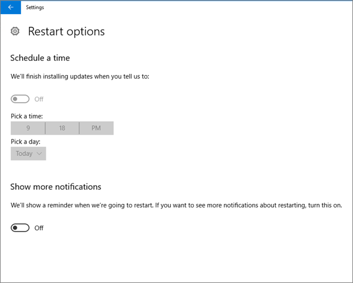
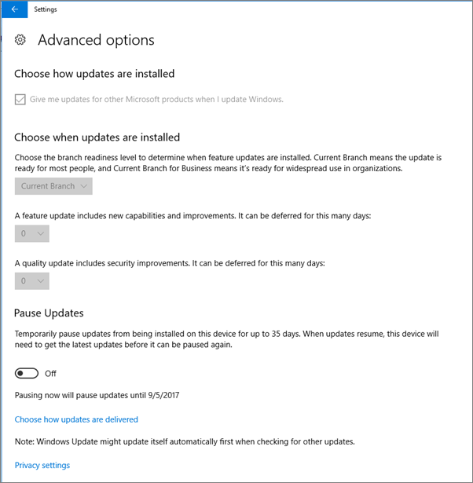
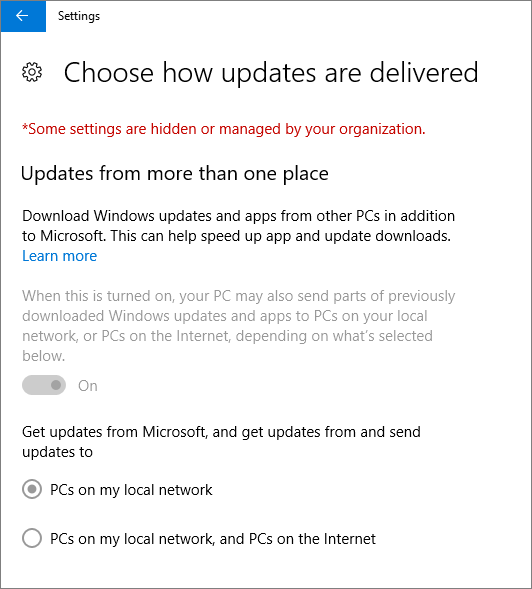
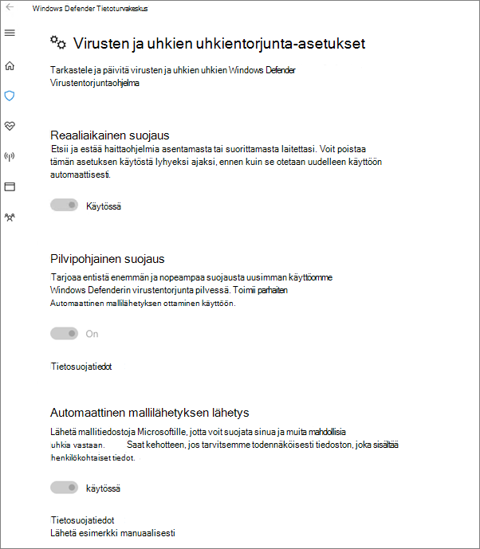

# Laitteiden suojausasetusten vahvistaminen Windows 10 -tietokoneissa

## Windows 10:n laitekäytäntöjen määrityksen varmistaminen

Kun olet [määrittänyt laitekäytännöt](protection-settings-for-windows-10-pcs.md), saattaa kestää muutama tunti, ennen kuin käytäntöä sovelletaan käyttäjien laitteissa. Voit varmistaa, että käytännöt on otettu käyttöön, perehtymällä Windowsin asetusnäyttöihin käyttäjien laitteissa. Koska käyttäjät eivät voi muokata Windows Updaten ja Windows Defenderin virustentorjunta-asetuksia Windows 10 -laitteissaan, monet asetukset näkyvät harmaina.
  
1. Siirry **Kohtaan Asetukset** \> **Päivitys &amp; -suojaus** \> **Windows UpdateN** \> **uudelleenkäynnistysasetukset** ja varmista, että kaikki asetukset näkyvät harmaina. 
    
    
  
2. Siirry **kohtaan Settings** \> **Update &amp; -suojaus** \> **Windows UpdateN** \> **lisäasetukset** ja varmista, että kaikki asetukset näkyvät harmaina. 
    
    
  
3. Go to **Settings** \> **Update &amp; security** \> **Windows Update** \> **Advanced options** \> **Choose how updates are delivered**.
    
    Varmista, että näet viestin (punaisena), että organisaatiosi on piilottanut tai hallinnut joitakin asetuksia ja että kaikki asetukset näkyvät harmaina.
    
    
  
4. To open the Windows Defender Security Center, go to **Settings** \> **Update &amp; security** \> **Windows Defender** \> click **Open Windows Defender Security Center** \> **Virus &amp; thread protection** \> **Virus &amp; threat protection settings**. 
    
5. Varmista, että kaikki asetukset näkyvät harmaina. 
    
    
  
## Aiheeseen liittyviä aiheita

[Microsoft 365 Businessin ohjeet ja resurssit](https://go.microsoft.com/fwlink/p/?linkid=853701)
  
[Microsoft 365 Businessin käytön aloittaminen](microsoft-365-business-overview.md)
  
[Microsoft 365 Businessin hallinta](manage.md)
  
[Windows 10 -tietokoneiden laitemääritysten määrittäminen](protection-settings-for-windows-10-pcs.md)
  

