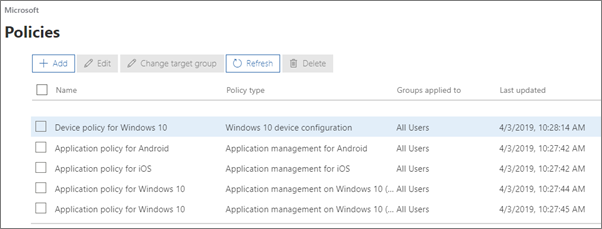
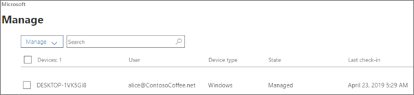

# Käytäntöjen ja laitteiden tarkasteleminen ja hallinta

## Laitekäytäntöjen tarkasteleminen ja muokkaaminen

1.  Siirry hallintakeskukseen osoitteessa <a href="https://go.microsoft.com/fwlink/p/?linkid=837890" target="_blank">https://admin.microsoft.com</a>.
2. Valitse vasemmasta siirtymisruudusta \> **Laitekäytännöt**. ****

    Tällä sivulla voit luoda, muokata, muuttaa kohderyhmää tai poistaa käytännön.

    
  
## Laitteiden tarkasteleminen ja hallinta

1. Valitse vasemmasta siirtymisruudusta **Laitteiden** \> **hallinta**. 
    
    Tällä sivulla voit valita yhden tai useamman laitteen ja poistaa yrityksen tiedot. Voit lisäksi palauttaa tehdasasetukset niihin Windows 10 -laitteisiin, joihin olet määrittänyt laitesuojausasetukset.
  
   

